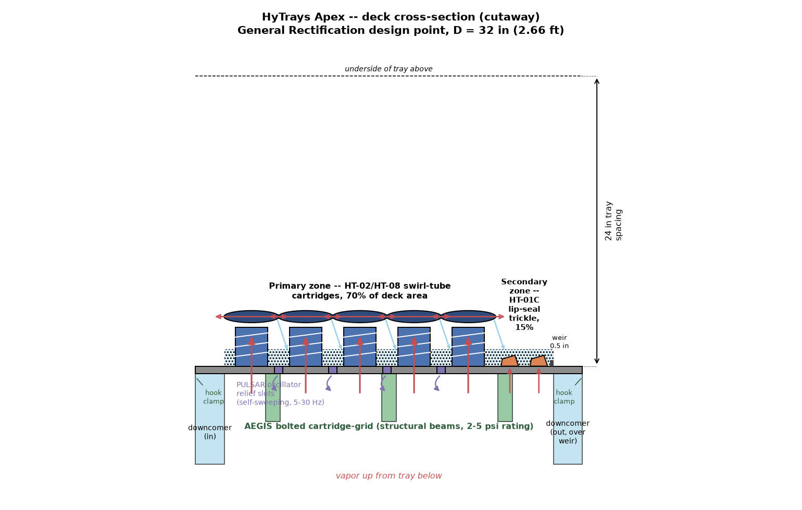
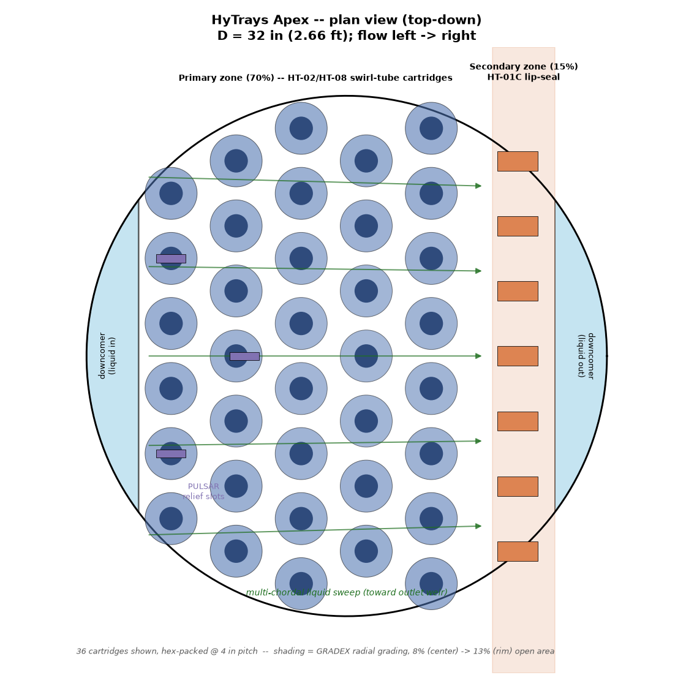
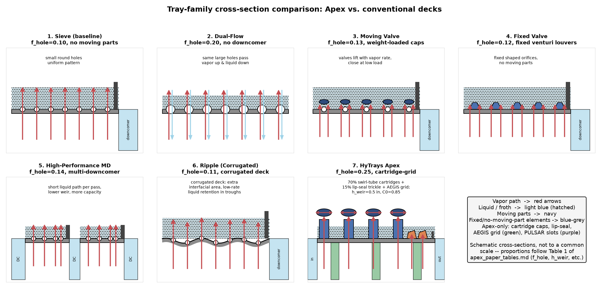
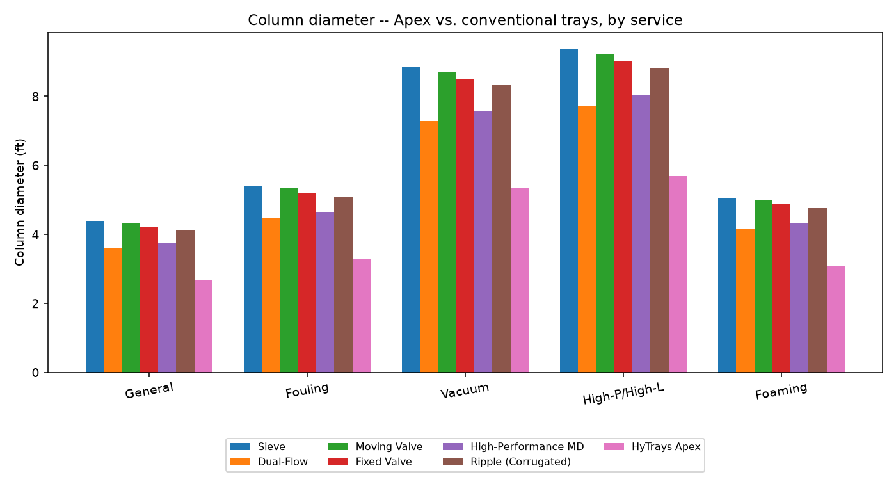
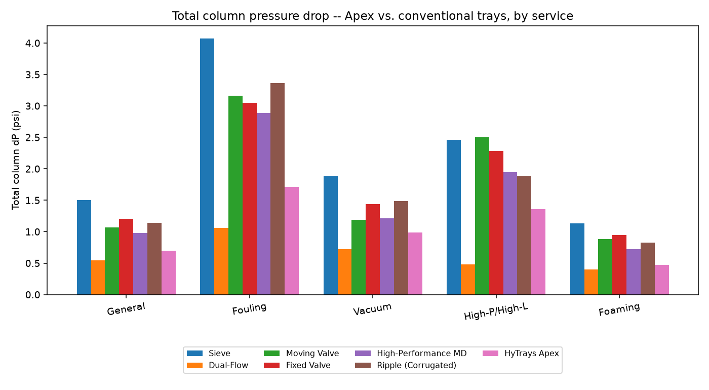
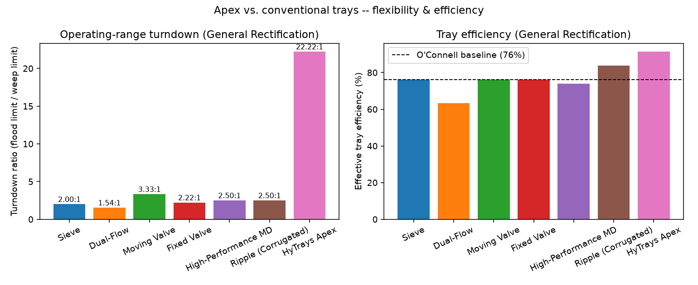
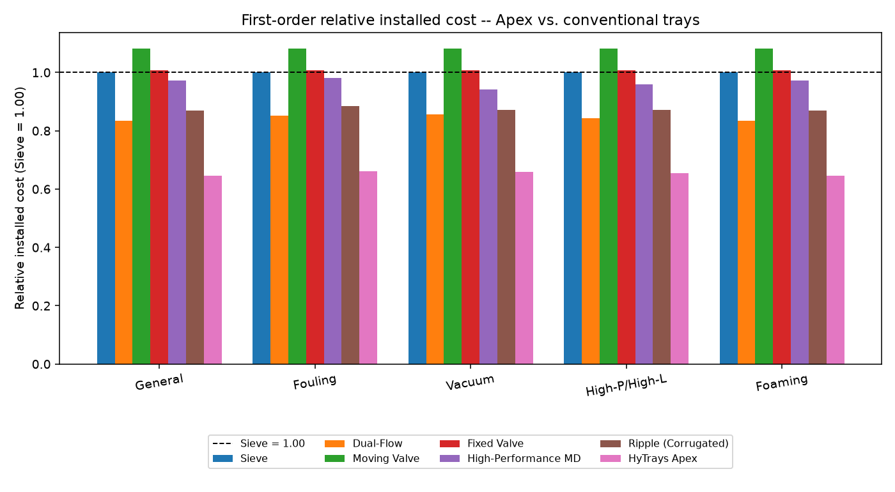
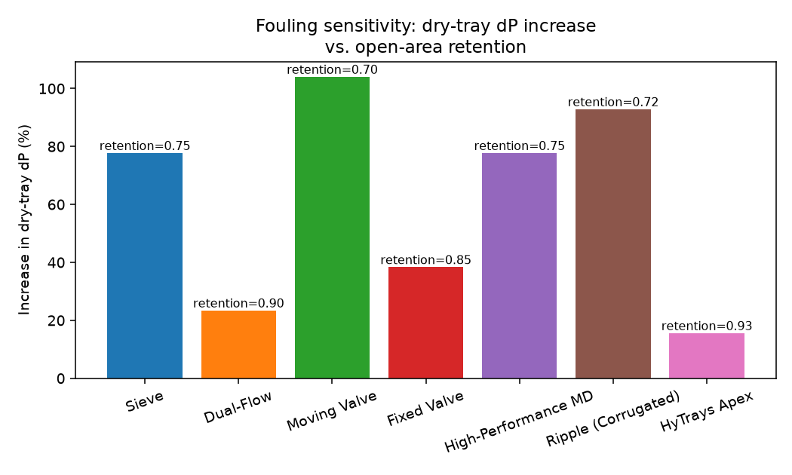

# HyTrays Apex -- Integrated Cartridge-Grid Tray: Technical Paper

**A first-order engineering evaluation of geometry, hydraulics, construction,
installation, cost and operating flexibility, benchmarked against six
conventional tray families.**

---

## How to read this document

This paper is the companion technical write-up to `HyTrays_Apex_concept.md`
(the architecture memo and 10-metric scorecard). Where the concept memo
*proposes* the Integrated Cartridge-Grid and scores it qualitatively, this
paper:

- derives every quantitative claim from the same 1-D hydraulics engine
  (`column_hydraulics.py`) and a new first-order cost model (`cost_model.py`),
- benchmarks Apex against **six conventional industry tray families** --
  Sieve, Dual-Flow, Moving Valve, Fixed Valve, High-Performance
  Multi-Downcomer and Ripple (Corrugated) -- rather than only against Sieve,
- works through Apex's physical geometry at a real design point (32 in
  diameter, General Rectification service) with scaled cross-section and
  plan-view drawings, and
- walks through construction, installation/maintenance, cost, thermal/energy
  savings, operating flexibility and the "extra" mechanisms (PULSAR,
  AEGIS, GRADEX, passive control) in turn.

All numbers below are reproducible: `run_apex_paper.py` regenerates
`output/apex_paper_comparison.csv`, `output/apex_paper_tables.md` and plots
21-25; `make_apex_drawings.py` regenerates the schematic drawings (30-32).
**This remains a first-order, illustrative model** -- a screening tool for
relative comparisons, not a vendor design. Every number carries the same
caveats as `HyTrays_Apex_concept.md` Sections 7-8, repeated here where
relevant.

---

## Table of contents

1. [Executive summary](#1-executive-summary)
2. [Design objectives -- the 10-metric "revolution" brief](#2-design-objectives----the-10-metric-revolution-brief)
3. [Parametric design equations](#3-parametric-design-equations)
4. [Apex geometry in detail](#4-apex-geometry-in-detail)
5. [Construction & manufacturing](#5-construction--manufacturing)
6. [Installation, turnarounds & cartridge-swap maintenance](#6-installation-turnarounds--cartridge-swap-maintenance)
7. [Technical comparison: Apex vs. six conventional tray families](#7-technical-comparison-apex-vs-six-conventional-tray-families)
8. [Cost analysis](#8-cost-analysis)
9. [Thermal & energy savings](#9-thermal--energy-savings)
10. [Operational flexibility & turndown](#10-operational-flexibility--turndown)
11. [Other Apex mechanisms ("the gimmicks")](#11-other-apex-mechanisms-the-gimmicks)
12. [Scorecard: mapping results back to the 10-metric brief](#12-scorecard-mapping-results-back-to-the-10-metric-brief)
13. [Limitations & R&D needs](#13-limitations--rd-needs)
14. [References & file index](#14-references--file-index)

---

## 1. Executive summary

HyTrays Apex is a single contacting deck -- the **Integrated
Cartridge-Grid** -- that combines five previously separate HyTrays
mechanisms (HT-02/HT-08 swirl-tube cartridges, HT-01C lip-seal trickle,
HT-03 GRADEX grading, HT-05 PULSAR oscillator relief, HT-07 AEGIS structural
grid) into one deck, evaluated here as a single `TrayType` against six
conventional tray families across five representative services.

Headline results (General Rectification design point, D = 32 in):

| Metric | Sieve (baseline) | HyTrays Apex | Change |
|---|---|---|---|
| Column diameter | 4.39 ft | **2.66 ft** | **-39%** |
| Total column pressure drop | 1.503 psi | **0.697 psi** | **-54%** |
| Operating-range turndown | 2.00:1 | **22.22:1** | **+11.1x** |
| Tray efficiency | 76.2% | **91.4%** | **+15.2 pts** |
| Dry-tray dP increase when fouled | +78% | **+16%** | best in family |
| Relative installed cost | 1.00 | **0.64** | **-36%** |

These are not independent wins -- they are downstream of one design choice:
**Apex's `capacity_factor = 2.50` and `f_active = 0.85` let the same vapour
duty be handled in a 39% smaller diameter**, and everything else (shell
cost, tray-hardware cost, pressure drop, even the absolute size of the
turndown "window") scales from there. The diameter reduction is **identical
across all five services** (general, fouling, vacuum, high-pressure/
high-liquid, foaming) because it depends only on `capacity_factor` and
`f_active`, which are fixed properties of the deck, not the service.

The most counter-intuitive result is **cost**: Apex's tray hardware is
estimated at **3.2x** the fabrication cost per unit deck area of a plain
sieve (precision cartridges vs. punched holes) -- yet the *total installed
cost* comes out **36% lower** than sieve, because the dominant cost driver
for a tray column is the **shell** (`D x H`), and shrinking the diameter by
39% cuts the shell-cost proxy by about half. Section 8 works through this in
detail.

---

## 2. Design objectives -- the 10-metric "revolution" brief

`HyTrays_Apex_concept.md` Section 1.2 set out a "revolution" brief: a single
deck that *simultaneously* delivers on ten metrics that conventional tray
designs trade off against each other one at a time.

| # | Metric | Target |
|---|---|---|
| 1 | Efficiency | >90% Murphree |
| 2 | Turndown | >20:1 |
| 3 | Pressure drop | Packing-level |
| 4 | Capacity | Grid-tray-level |
| 5 | Fouling resistance | Near self-cleaning |
| 6 | Maintenance | Cartridge swap |
| 7 | Stability | No weeping/dumping |
| 8 | Cost | Manufacturable at scale |
| 9 | Control | Real-time adaptive |
| 10 | Energy | Major reduction |

...plus, qualitatively: **no stagnant corners, no jet flooding, no dead
zones, no weeping, no dumping, no entrainment, a massive turndown ratio.**

`HyTrays_Apex_concept.md` Section 3 explains *why* no single conventional
mechanism can hit all ten -- each goal pulls tray geometry in a different
direction (e.g. fouling resistance wants large simple holes; turndown wants
a secondary low-load path; structural rating wants thick plate and dense
beams, which costs open area). Apex's answer is architectural: **give each
goal its own zone or treatment on the same deck** rather than asking one
mechanism to do everything. Section 4 of this paper works through what that
architecture actually looks like in steel, and Section 12 closes the loop by
scoring each of the ten metrics against the results developed in Sections
7-10.

---

## 3. Parametric design equations

This section documents every equation `column_hydraulics.py` uses to size
and rate a tray, in the order it applies them. These equations are applied
identically to all seven trays in the comparison (Sieve, Dual-Flow, Moving
Valve, Fixed Valve, High-Performance MD, Ripple, Apex) -- the *only* thing
that differs between trays is the `TrayType` parameter set (Table 1,
Section 7.1). All Apex worked numbers in Section 4 come from plugging
`APEX`'s parameters into these same equations at the General Rectification
design point.

### 3.1 Flow parameter (FLV)

$$
\mathrm{FLV} = \frac{L}{V} \sqrt{\frac{\rho_V}{\rho_L}}
$$

`L`, `V` = liquid/vapor mass flow (lb/hr); `rho_L`, `rho_V` = liquid/vapor
density (lb/ft^3). FLV is the classic Souders-Brown flow parameter -- the
x-axis of every flooding correlation chart. High-reflux, high-pressure
services (e.g. the C3/C4 splitter case) have FLV near 1; vacuum/light-vapor
services have FLV near 0.01-0.05.

### 3.2 Fair capacity parameter (C_SBF)

$$
C_{SBF}\,[\mathrm{m/s}] = 0.0105 + 8.127\times10^{-4}\,\mathrm{HS}[\mathrm{mm}]^{0.755}
\, e^{-1.463\,\mathrm{FLV}^{0.842}}
$$

`HS` = tray spacing (mm). This is the closed-form curve fit to Fair's
C_SBF chart (Fair 1961; widely used in process simulators -- see Kister,
*Distillation Design*). The result is converted ft/s -> m/s -> ft/s
(x3.28084) for use downstream. C_SBF depends **only on FLV and tray
spacing** -- it is identical for all seven trays at a given service; the
tray-specific capacity differences come entirely from `capacity_factor` in
the next step.

### 3.3 Flooding velocity (Souders-Brown, surface-tension corrected)

$$
u_{nf} = C_{SBF}\left(\frac{\sigma}{20}\right)^{0.2}
\sqrt{\frac{\rho_L - \rho_V}{\rho_V}}\;\times\;\mathrm{capacity\_factor}\;\times\;\mathrm{system\_factor}
$$

`sigma` = surface tension (dyn/cm), normalized against the 20 dyn/cm
reference Fair's chart was built on. `capacity_factor` is the tray's
parametric capacity uplift (1.00 for Sieve, 2.50 for Apex -- Table 1).
`system_factor` is a service-wide derate for foaming systems (0.75 for the
Foaming case, 1.00 elsewhere) -- it is the *only* place a service property
(rather than a tray property) enters this step, and it is applied uniformly
to every tray.

### 3.4 Design velocity, area & diameter

$$
u_{design} = f_{flood}\,u_{nf}
\qquad
A_{active} = \frac{\dot V}{u_{design}}
\qquad
A_{col} = \frac{A_{active}}{f_{active}}
\qquad
D = \sqrt{\frac{4 A_{col}}{\pi}}
$$

`f_flood` is the service's design fraction of flooding (0.80 typical, 0.65
for the derated Fouling case). `V_dot` = vapor volumetric flow (ft^3/s) =
`v_mass_lb_hr / (3600 * rho_V)`. `f_active` is the tray's active (bubbling)
area as a fraction of the total column cross-section (0.78 for Sieve, 0.85
for Apex -- the rest is downcomer). **This is the step where Apex's diameter
advantage is created**: a higher `capacity_factor` raises `u_design`
(smaller `A_active` for the same `V_dot`), and a higher `f_active` means a
smaller `A_active` maps to an even smaller `A_col`. Both effects compound
into the diameter ratio `sqrt(capacity_factor x f_active_ratio)` -- for Apex
vs. Sieve, `sqrt(2.50 x 0.85/0.78) = sqrt(2.724) = 1.651`, i.e. Apex's
diameter is `1/1.651 = 0.605` of Sieve's -- a 39.5% reduction, matching
Table 5's -39% to within rounding.

### 3.5 Dry-tray pressure drop (orifice equation)

$$
f_{hole,eff} = f_{hole} \times \big(\text{fouling\_open\_area\_retention if fouled, else } 1.0\big)
$$
$$
A_{hole} = f_{hole,eff}\,A_{active}
\qquad
u_{hole} = \frac{\dot V}{A_{hole}}
$$
$$
\Delta P_{dry} = \max\left(0.186\left(\frac{u_{hole}}{C_0}\right)^2 \frac{\rho_V}{\rho_L},\ \Delta P_{dry,floor}\right)
$$

`f_hole` is the open-area fraction of the active area (0.10 for Sieve, 0.25
for Apex -- the largest in the family). `C_0` is the orifice discharge
coefficient (0.73 for Sieve, 0.85 for Apex -- large smooth slots with no
valve hardware). `dp_dry_floor_in` is a hardware-imposed minimum (0.40 in.
for Moving Valve's valve weight; 0.10 in. for Apex's cartridge/sleeve
hardware; 0.00 in. for Sieve and Dual-Flow). `Delta P_dry` is in inches of
liquid.

### 3.6 Clear-liquid height (Francis weir)

$$
Q_L\,[\mathrm{gpm}] = \frac{L}{\rho_L} \times 0.124675
\qquad
L_{weir}\,[\mathrm{in}] = 0.73\,D\,[\mathrm{ft}]\times 12
$$
$$
h_{ow} = 0.48\left(\frac{Q_L}{L_{weir}}\right)^{2/3}
\qquad
h_{clear} = h_{weir} + h_{ow}
$$

`h_ow` is the Francis-weir crest height over the outlet weir; `h_weir` is
the weir height itself (2.0 in. for Sieve, 0.5 in. for Apex -- the lowest in
the family, since mechanical disengagement (Section 4.1) replaces
weir-height-driven vapour/liquid separation). For Dual-Flow (`has_downcomer
= False`, no overflow weir), `h_clear` is fixed at a representative 1.0 in.
operating level instead.

### 3.7 Wet-tray pressure drop

$$
\Delta P_{tray}\,[\mathrm{in.\ liquid}] = \Delta P_{dry} + \mathrm{aeration\_factor}\times h_{clear}
\qquad
\Delta P_{tray}\,[\mathrm{psi}] = \frac{\Delta P_{tray}\,[\mathrm{in.}]}{12}\times\frac{\rho_L}{144}
$$

`aeration_factor` (beta) converts the static clear-liquid height into an
*aerated froth* pressure-drop contribution (0.55 for Sieve -- dense gravity
froth; 0.38 for Apex -- the lowest in the family, because mechanical
disengagement produces a leaner froth than gravity settling).

### 3.8 Downcomer backup

$$
A_{dc} = \frac{A_{col} - A_{active}}{2}
\qquad
h_{da} = 0.03\left(\frac{Q_L}{100\,A_{dc}}\right)^2
$$
$$
h_{dc} = \Delta P_{dry} + h_{clear} + h_{da}
\qquad
h_{dc,limit} = 0.5\,(\mathrm{tray\_spacing} + h_{weir})
\qquad
\%\mathrm{backup} = \frac{h_{dc}}{h_{dc,limit}}\times 100
$$

`A_dc` is *one* downcomer's area (the non-active area split between the two
downcomers). `h_da` is the downcomer-apron entrance/exit loss. The 50%-of-
tray-spacing backup limit (`h_dc_limit`) is the standard flood-by-
downcomer-jump criterion -- if `h_dc` exceeds it, the downcomer itself floods
before the bubbling deck does. Dual-Flow has no downcomer, so these terms
are `None`/`n/a` for that tray.

### 3.9 Operating range & turndown

$$
\mathrm{max\_load\_pct} = \frac{100}{f_{flood}}
\qquad
\mathrm{min\_load\_pct} = \mathrm{min\_load\_frac}\times\mathrm{max\_load\_pct}
\qquad
\mathrm{turndown} = \frac{\mathrm{max\_load\_pct}}{\mathrm{min\_load\_pct}} = \frac{1}{\mathrm{min\_load\_frac}}
$$

`min_load_frac` is the *only* parameter that sets turndown -- it is the
fraction of the design (100%-of-flood-basis) throughput below which the
tray weeps/dumps. Apex's `min_load_frac = 0.045` gives the headline
22.22:1 turndown (Section 10); Sieve's 0.50 gives 2.00:1.

### 3.10 Efficiency & actual tray count

$$
E_{OC} = 51 - 32.5\,\log_{10}(\alpha\,\mu_L)\quad\text{(clipped to }[1,100]\text{)}
$$
$$
E_{tray} = \min(E_{OC}\times\mathrm{efficiency\_factor},\ 100)
\qquad
N_{actual} = \left\lceil \frac{N_{theoretical}}{E_{tray}/100} \right\rceil
$$
$$
H_{column}\,[\mathrm{ft}] = N_{actual}\times\frac{\mathrm{tray\_spacing}\,[\mathrm{in}]}{12} + 10
\qquad
\Delta P_{total} = N_{actual}\times\Delta P_{tray}\,[\mathrm{psi}]
$$

`E_OC` is the O'Connell (1946) overall column efficiency from the
separation's relative volatility (`alpha`) and liquid viscosity (`mu_L`) --
a property of the *service*, identical for every tray. `efficiency_factor`
is the tray's relative uplift on that baseline (1.00 for Sieve, 1.20 for
Apex -- the highest in the family, from HT-03 GRADEX-style radial grading
and multi-chordal sweep). The "+10 ft" in the column-height formula is a
fixed sump/disengagement-space allowance.

### 3.11 Relative installed cost (`cost_model.py`)

$$
\mathrm{shell\_proxy} = D \times H_{column}
\qquad
\mathrm{tray\_proxy} = D^2 \times N_{actual} \times \mathrm{relative\_unit\_cost\_factor}
$$
$$
\mathrm{relative\_installed\_cost} = 0.70\times\frac{\mathrm{shell\_proxy}}{\mathrm{shell\_proxy}_{Sieve}}
\;+\;0.30\times\frac{\mathrm{tray\_proxy}}{\mathrm{tray\_proxy}_{Sieve}}
$$

This is a *first-order, illustrative* cost model (Section 8 develops it
fully). `shell_proxy` (`D x H`) stands in for the dominant shell+heads+
supports cost, which for a fixed pressure class scales roughly with shell
surface area. `tray_proxy` (`D^2 x N x k_cost`) stands in for the tray
hardware cost -- deck area per tray (`D^2`) times the number of trays
(`N_actual`) times a fabrication-complexity multiplier
(`relative_unit_cost_factor`, Table 1's last column). The 70/30 split
follows Towler & Sinnott-style guidance that the vessel (shell+heads+
supports) typically dominates a tray column's bare-module cost, with
trays/internals at ~15-30%.

---

## 4. Apex geometry in detail

This section walks through Apex's physical layout at its **General
Rectification design point** -- D = 32 in (2.66 ft), the smallest of the
five service design points and the one used throughout this paper's
drawings (Figures 1-2 below). All numbers come from Table 2
(`output/apex_paper_tables.md`) and the same equations as Section 3,
evaluated with `APEX`'s parameters and the `GENERAL` service case.

### 4.1 Two-zone-plus-three-treatments architecture

Apex's active area (`f_active = 0.85` of the column cross-section, vs.
Sieve's 0.78) splits into **two distinct contacting zones**, with **three
deck-wide treatments** layered over both:

```
        VAPOR + LIQUID  (co-current swirl, mechanical disengage)
            \\\   ///     \\\   ///        .  .  .
         ____\\\_///_______\\\_///_____.__.__.__.____
        |  [VORTEXA   ] [VORTEXA   ]  [ LipSeal trickle ] |  <- vane caps + PULSAR
   DC -->| /=sleeves=\   /=sleeves=\    /==lip valves==\  |<-- DC
        |  ~70% area, GRADEX-graded  |~15% area, secondary|
        |__beams_____beams___________beams______beams____|  <- AEGIS cartridge grid
              <----  multi-chordal liquid sweep  ---->
```

| Zone / treatment | Share of `A_col` | Mechanism | Source |
|---|---|---|---|
| **Primary zone** | 70% | HT-02/HT-08 swirl-tube cartridges, mechanical vapour/liquid disengagement | Section 4.2 |
| **Secondary zone** | 15% | HT-01C lip-seal trickle path | Section 4.3 |
| **Downcomers (both sides)** | 15% (= 1 - `f_active`) | Conventional liquid-handling chutes | Section 4.4 |
| GRADEX radial/azimuthal grading + multi-chordal sweep | applied across both zones | efficiency / no dead zones | Section 11.3 |
| PULSAR oscillator relief slots | between cartridges, in the deck plate | self-cleaning | Section 11.1 |
| AEGIS bolted cartridge-grid | structural overlay below the deck | 2-5 psi rating + cartridge-swap | Section 11.2 |

**Figure 1** (`output/30_apex_cross_section.png`) shows this in cutaway
elevation; **Figure 2** (`output/31_apex_plan_view.png`) shows it in plan.
Both are drawn to scale for D = 32 in.



*Figure 1 -- Apex deck cutaway elevation, General Rectification design point
(D = 32 in / 2.66 ft, 24 in tray spacing). Red arrows show the vapour path:
up through each swirl-tube cartridge, then sideways under the vane cap
(mechanical disengagement) before re-entering the froth. Light-blue hatching
is the aerated froth/liquid layer (h_clear = 1.42 in) sitting behind the 0.5
in outlet weir. Orange wedges are the secondary-zone lip valves. Purple
rectangles between cartridges are PULSAR oscillator relief slots; green
blocks below the deck are the AEGIS structural ribs, bolted to the deck
plate via hook clamps at the column wall.*



*Figure 2 -- Apex plan view (top-down), D = 32 in, flow left to right. 36
swirl-tube cartridges are hex-packed at 4 in pitch across the 70% primary
zone; shading intensity encodes GRADEX's radial open-area grading (8% at
centre -> 13% at rim). The 15% secondary (lip-seal) zone runs along the
outlet edge; the two light-blue chords on either side are the inlet/outlet
downcomers. Green arrows show the multi-chordal liquid sweep -- liquid
crosses the deck along chords tuned to the cartridges' swirl angle rather
than in one straight pass, eliminating corner dead zones.*

### 4.2 Primary zone -- swirl-tube cartridges (70% of `A_col`)

| Quantity | Value |
|---|---|
| Area | 3.88 ft^2 (559 in^2) |
| Open (slot) area | 0.97 ft^2 (140 in^2) |
| Open-area fraction of zone | ~25% (= `f_hole`) |
| Cartridges (illustrative, plan view) | 36, hex-packed @ 4 in pitch |
| Cartridge body | swirl tube + helical-indexed sleeve (HT-08 VORTEXA), domed vane cap (mechanical disengagement) |

Each cartridge is a vertical tube: vapour enters the bottom, is spun at
30-60 g by the tube's internal geometry, and exits through a **domed vane
cap** that mechanically separates entrained liquid from vapour before the
vapour re-enters the space below the tray above. This is the mechanism
behind Apex's high `C0` (0.85) and low `aeration_factor` (0.38) -- the froth
leaving this zone is *leaner* than a gravity-settled sieve froth, because
disengagement is done by the cap geometry, not by giving the bubbles time
and height to separate on their own.

**HT-08's helical sleeve** rides on a back-drivable helical constraint: as
vapour load rises, the sleeve lifts and rotates, opening more tangential
slot area; as load falls, it closes again. This is *passive* -- there is no
actuator, sensor or signal (Section 11.4) -- and it extends this zone's own
turndown from HT-02's ~2.5:1 to ~8:1. A sleeve that sticks simply reverts to
HT-02's fixed-geometry behaviour: benign, no cascading failure.

**GRADEX radial grading** (Section 11.3) varies each cartridge's open-area
fraction with its radial position: ~8% near the column centreline rising to
~13% near the wall (Figure 2's shading). This compensates for the
naturally lower liquid residence time near the wall on a co-current deck,
pushing the whole zone toward plug flow.

### 4.3 Secondary zone -- lip-seal trickle path (15% of `A_col`)

| Quantity | Value |
|---|---|
| Area | 0.83 ft^2 (120 in^2) |
| Open (slot) area | 0.21 ft^2 (30 in^2) |
| Mechanism | HT-01C check-valve lip flaps |

The secondary zone is a strip of **HT-01C lip-seal valves** along the
outlet edge (Figure 2, orange rectangles). Each lip is a hinged flap that
lifts under vapour pressure and **seals shut** (rather than just resting
closed) when vapour rate falls -- this check-valve action is what gives
HT-01C its own >=30% wider stable window than plain sieve.

On its own this zone is unremarkable (a ~2.63:1 turndown deck covering 15%
of the area would not move the needle much). Its purpose is what happens
**when the primary zone benignly closes** at very low overall load -- this
hand-off is the mechanism behind Apex's 22.22:1 modeled turndown and is
explained in full in Section 10.

### 4.4 Downcomers & weir (15% of `A_col`)

| Quantity | Value |
|---|---|
| Total downcomer area | 0.83 ft^2 (120 in^2) |
| Per side (chord width) | 60 in^2 each (~7.5% of `A_col` each side) |
| Outlet weir height (`h_weir`) | 0.5 in -- lowest in the family |
| Francis weir crest (`h_ow`) at design liquid rate | 0.917 in |
| Clear-liquid height (`h_clear = h_weir + h_ow`) | **1.417 in** |

Two chordal downcomers (inlet and outlet, Figure 2's light-blue segments)
occupy the remaining 15% of the cross-section -- the standard `1 -
f_active` split. The **0.5 in weir** is the lowest of all seven trays in
this comparison (next-lowest is High-Performance MD and Ripple at 1.0-1.5
in, Sieve/Moving Valve/Fixed Valve at 2.0 in). A short weir is only viable
here because Apex does not rely on weir height for vapour/liquid
disengagement (Section 4.2 does that mechanically) -- on a conventional
tray, cutting the weir this low would dump liquid and crash efficiency.
The trade-off (a higher Francis crest for the same liquid rate at a smaller
diameter) shows up as Apex's tightest downcomer-backup margin in the
High-Pressure/High-Liquid service (Section 7.9, Table 3) -- flagged as a
residual risk in Section 13.

### 4.5 Worked hydraulics at the design point

| Quantity | Value | From |
|---|---|---|
| Column diameter `D` | 2.66 ft (32 in) | Section 3.4 |
| Column cross-section `A_col` | 5.55 ft^2 (799 in^2) | Section 3.4 |
| Active area `A_active = f_active * A_col` | 4.72 ft^2 (679 in^2) | Section 3.4 |
| Hole velocity `u_hole` | **12.14 ft/s** | Section 3.5 |
| Dry-tray pressure drop `dP_dry` | **1.287 in. liquid** | Section 3.5 |
| Clear-liquid height `h_clear` | **1.417 in.** (0.5 weir + 0.917 crest) | Section 3.6 |
| Wet-tray pressure drop `dP_tray` | 0.0317 psi/tray | Section 3.7 |
| Tray efficiency `E_tray` | 91.4% | Section 3.10 |
| Actual trays `N_actual` (20 theoretical) | 22 | Section 3.10 |
| Column height | 54.0 ft | Section 3.10 |
| Total column pressure drop | **0.697 psi** | Section 3.10 |

For comparison, a Sieve tray sized for the same duty needs D = 4.39 ft, 27
actual trays, 64.0 ft of height and 1.503 psi total pressure drop -- every
one of these numbers is worse than Apex's, by construction (Section 3.4's
diameter-ratio argument propagates through all of them).

### 4.6 Tray spacing

All seven trays in this comparison use the service's standard tray spacing
(24 in for General/Fouling/High-P-High-L/Foaming; 30 in for Vacuum) --
Apex's compact geometry (Section 4.2-4.4) is **not** a tray-spacing
reduction; it is a diameter and tray-count reduction at *conventional*
spacing. This is a deliberate scoping choice: tray-spacing reduction is a
separate, mechanically-driven lever (clearance for cartridge servicing,
Section 6) that is not claimed here.

---

## 5. Construction & manufacturing

Apex's deck is built from **four distinct fabricated components**, all of
which exist individually in the HT-0X family (`HyTrays_Apex_concept.md`
Section 3) -- Apex's manufacturing novelty is in how they are *combined on
one deck plate*, not in any single new fabrication process.

### 5.1 Primary-zone cartridges (HT-02/HT-08 lineage)

Each of the ~36 primary-zone cartridges (Section 4.2) is a self-contained,
bolt-in unit:

- **Swirl tube body** -- a precision-formed (deep-drawn or spun) tube with
  internal helical vanes that impart 30-60 g tangential acceleration to the
  rising vapour/froth (HT-02 CVS geometry).
- **Helical-indexed sleeve** -- a close-tolerance sliding sleeve riding on a
  back-drivable helical thread, mechanically coupling axial lift (from
  vapour thrust) to rotation, which opens/closes tangential slot ports
  (HT-08 VORTEXA). This is the only moving part in the primary zone, and its
  failure mode is benign (reverts to fixed HT-02 geometry, Section 4.2).
- **Domed vane cap** -- a stamped/spun dome with internal disengagement
  vanes, mechanically separating liquid droplets from the swirling vapour
  exit stream before it reaches the tray above.
- **GRADEX-graded perforation pattern** -- the tube wall and cap are
  perforated/slotted to a radius-dependent open-area target (8% center ->
  13% rim, Section 4.2), so cartridges are not interchangeable between
  radial positions -- each is built (or selectively masked during
  perforation) to its position's grading.

These four sub-components are the main driver of Apex's
`relative_unit_cost_factor = 3.20` (Table 1) -- a precision-formed,
multi-part, helically-fitted cartridge with a graded perforation pattern is
inherently more involved per unit deck area than a flat punched sieve panel
(1.00), a stamped valve cap on a punched deck (Moving Valve, 1.35), or even
the most complex conventional option modeled here (High-Performance MD's
multi-downcomer panel set, 1.55). Section 8 shows why this 3.2x *unit* cost
multiple does not translate into a 3.2x *installed* cost multiple.

### 5.2 Secondary-zone cartridges (HT-01C lineage)

The secondary zone's lip-seal valves (Section 4.3) are simpler:
stamped/formed flap-and-seat assemblies, hinged on one edge, supplied as a
strip cartridge sized to the 15% secondary-zone width. Because the check-
valve action relies on a positive seal at the seat (not just gravity), seat
flatness and flap-to-seat fit tolerances are tighter than a simple sieve
hole -- closer to a moving-valve tray's cap-to-deck fit, but with far fewer
parts (no valve legs/cages/guides).

### 5.3 Deck plate -- GRADEX perforation + PULSAR slots

The base deck plate carries two machined features beyond the cartridge
cutouts:

- **PULSAR oscillator relief slots** (Section 11.1) -- small Coanda-island
  fluidic-oscillator geometries cut directly into the deck plate *between*
  cartridges. These have **no moving parts of their own** -- the oscillation
  is a fluid-dynamic effect of the slot geometry -- so they add geometric
  machining complexity to the deck plate but zero additional moving-part
  count to the cartridge inventory.
- **GRADEX azimuthal map** -- beyond the radial grading built into each
  cartridge (5.1), the deck plate's cartridge cutout pattern itself follows
  an azimuth map derived from a flow-field solver, so cartridge positions
  are not on a uniform grid everywhere -- denser near inlet/outlet
  transitions where the flow field is least uniform.

### 5.4 AEGIS bolted structural grid

Below the deck plate, a **rib-stiffened beam grid** (HT-07 AEGIS lineage,
Figure 1's green blocks) carries both the normal dead-weight/operating
loads and a **2-5 psi transient uplift rating** -- i.e. the deck can survive
a relief-valve-driven pressure surge from below without lifting off its
seats. Three features deliver this:

- **Dense beam grid** -- closer beam spacing than a conventional support-ring
  + beam layout, sized so the *cartridge bolt pattern* (5.1/5.2) lines up
  with beam intersections rather than requiring a separate sub-frame.
- **Hook clamps** at the column-wall support ring (Figure 1) -- positively
  retain the deck panel against uplift, replacing (or supplementing) a
  simple gasketed seat.
- **Relief flaps** -- localized, spring-loaded flap sections that open above
  the 2-5 psi design rating, giving the deck an overpressure path that does
  not require the whole panel to fail.

This structural overlay is explicitly **decoupled from the hydraulic
fingerprint** -- it is the same reasoning `HyTrays_Apex_concept.md` Section
3.5 gives for why HT-07 AEGIS itself has no `TrayType` entry (it leaves
normal hydraulics unchanged). It shows up in this paper only as part of the
fabrication-complexity story (5.1's cost discussion) and the maintenance
story (Section 6).

### 5.5 Materials

No new material classes are introduced versus a conventional high-end
valve/grid tray -- 304/316 stainless or duplex deck plate and cartridge
bodies, carbon-steel or matching-alloy structural grid, consistent with
standard tray-internals practice for the service. The cost driver is
**fabrication complexity** (precision forming, helical fitting, graded
perforation, oscillator machining), not exotic materials -- this is why the
cost model (Section 8) attaches the multiplier to the *tray-hardware* term
only, not to a material-grade adjustment.

---

## 6. Installation, turnarounds & cartridge-swap maintenance

### 6.1 Initial installation

Apex installs like any modern bolt-in tray package: the AEGIS structural
grid (5.4) is set on the column's support rings and secured via hook
clamps, then primary-zone cartridges (5.1) and secondary-zone strip
cartridges (5.2) are lowered through the manway and bolted into their grid
positions -- 36 primary cartridges plus the secondary strip per tray at the
General Rectification design point (Section 4.2). Because every cartridge
on a given tray is one of a small number of types (graded only by radial
position, 5.1), spares logistics are simpler than a tray with many distinct
panel shapes (e.g. a multi-downcomer tray's several different deck-panel
geometries, Section 7.6).

### 6.2 Turnaround workflow -- cartridge swap, not deck replacement

This is the practical payoff of the bolt-in architecture (5.1, 5.4):

| Conventional deck (welded/integral panels) | Apex (bolted cartridges on AEGIS grid) |
|---|---|
| A fouled, eroded, or damaged section requires cutting out and re-welding a deck panel -- significant fitter-hours, hot work permits, post-weld inspection | Affected cartridge(s) unbolted and lifted out; replacement cartridge(s) bolted in. No hot work. |
| Deck-wide rework if damage is structural (panel buckling, support-beam damage) | AEGIS grid (5.4) is independent of the cartridges -- a damaged cartridge does not imply a damaged grid |
| Inspection requires removing panels to access support structure | Cartridges can be pulled individually for inspection without disturbing neighbours |

A **stuck HT-08 helical sleeve** (the primary zone's only moving part,
5.1) is the most likely wear item; its failure mode reverts the cartridge to
fixed HT-02 geometry (Section 4.2) -- meaning a stuck sleeve is a
*performance* degradation (that cartridge's turndown contribution drops from
~8:1 to ~2.5:1), not a *safety* or *flooding* event, so it can wait for the
next scheduled turnaround rather than forcing an unplanned outage.

### 6.3 Upset tolerance (2-5 psi rating)

The AEGIS-style structural rating (5.4) means a relief-valve lift, a slug of
flash vapour, or a momentary loss of reflux that pressures the tray deck
from below by up to 2-5 psi is a **design case**, not a deck-destroying
event. On a conventional deck, this kind of transient is a common cause of
"dished" or dislodged panels that then require the deck-replacement workflow
in 6.2's left column -- even when the column itself was never overpressured
beyond its relief setting. Apex's relief flaps (5.4) give the deck its own
local overpressure path, so a transient that *would* have dished a
conventional panel instead vents locally and resets.

### 6.4 Inspection & instrumentation

PULSAR's self-sweeping slots (Section 11.1, 5.3) keep cartridge faces and
inter-cartridge gaps visually clear at the next opportunity for a borescope
inspection -- there is markedly less "is that fouling or is that just how it
looks" ambiguity than on a tray that has been weeping/dumping at the
inspected load. Optional instrumentation-only ports (pressure/temperature
taps, no actuation) can be fitted into the deck plate (5.3) alongside the
PULSAR slots for DCS trending without compromising the passive-control story
(Section 11.4).

---

## 7. Technical comparison: Apex vs. six conventional tray families

### 7.1 The seven decks at a glance

**Table 1 -- `TrayType` parameters, all seven trays**

| Tray | f_active | f_hole | h_weir (in) | C0 | dp_dry_floor (in) | Aeration | Capacity factor | Efficiency factor | Turndown | Fouling retention | Rel. unit cost |
|---|---|---|---|---|---|---|---|---|---|---|---|
| Sieve | 0.78 | 0.10 | 2.0 | 0.73 | 0.00 | 0.55 | 1.00 | 1.00 | 2.00:1 | 0.75 | 1.00 |
| Dual-Flow | 1.00 | 0.20 | 0.0 | 0.73 | 0.00 | 0.40 | 1.15 | 0.83 | 1.54:1 | 0.90 | 0.70 |
| Moving Valve | 0.78 | 0.13 | 2.0 | 0.85 | 0.40 | 0.55 | 1.03 | 1.00 | 3.33:1 | 0.70 | 1.35 |
| Fixed Valve | 0.78 | 0.12 | 2.0 | 0.80 | 0.05 | 0.52 | 1.08 | 1.00 | 2.22:1 | 0.85 | 1.20 |
| High-Performance MD | 0.85 | 0.14 | 1.0 | 0.80 | 0.10 | 0.50 | 1.25 | 0.97 | 2.50:1 | 0.75 | 1.55 |
| Ripple (Corrugated) | 0.80 | 0.11 | 1.5 | 0.75 | 0.00 | 0.50 | 1.10 | 1.10 | 2.50:1 | 0.72 | 1.15 |
| **HyTrays Apex** | **0.85** | **0.25** | **0.5** | **0.85** | 0.10 | **0.38** | **2.50** | **1.20** | **22.22:1** | **0.93** | 3.20 |

Bold values are family-best (or, for Apex's cost factor, family-worst on a
*unit* basis -- Section 8 explains why this does not carry through to
installed cost). Figure 3 below shows all seven cross-sections schematically
at the same scale; Sections 7.2-7.8 then take each tray in turn.



*Figure 3 -- Schematic cross-sections of all seven trays, drawn to a common
frame. Red arrows = vapour path; light-blue hatching = liquid/froth; navy =
fixed deck/cartridge elements; green = moving valve caps; orange = Apex's
lip-seal secondary zone; purple = PULSAR slots. Not to a single physical
scale across panels -- each panel illustrates that tray's characteristic
flow pattern, weir arrangement and (where applicable) downcomer count. See
Table 1 for `f_hole`, `h_weir`, etc.*

### 7.2 Sieve (conventional baseline)

**Geometry & construction.** The simplest tray geometry: a flat perforated
deck plate (typically 3/16-3/8 in. holes on a triangular pitch, `f_hole =
0.10` of the active area), a single (or double-pass) downcomer per side, and
a fixed outlet weir (`h_weir = 2.0 in`). No moving parts.

**Operation.** Vapour rises uniformly through the perforations; liquid
flows across the deck and over the weir into the downcomer. Capacity and
efficiency are textbook reference points (`capacity_factor = 1.00`,
`efficiency_factor = 1.00` by definition). Turndown is limited by weeping:
below ~50% of design vapour rate (`min_load_frac = 0.50`), vapour velocity
through the holes can no longer support the liquid head, giving the
family's modest **2.00:1** turndown.

**At the General Rectification design point**: D = 4.39 ft, 27 trays, 64.0
ft column, 1.503 psi total dP, 76.2% tray efficiency, 34% downcomer backup.

**Apex vs. Sieve.** Apex's `f_hole` is 2.5x higher (0.25 vs 0.10) with a
higher `C0` (0.85 vs 0.73) and a much lower weir (0.5 vs 2.0 in) -- all
three push toward lower pressure drop and higher capacity, at the cost of
needing mechanical disengagement (Section 4.2) to do the job the sieve's
weir height and froth residence time do passively.

### 7.3 Dual-Flow

**Geometry & construction.** No downcomers at all (`has_downcomer = False`,
`f_active = 1.00` -- the *entire* cross-section is active). Large round
holes (`f_hole = 0.20`, double Sieve's) cover the full deck; vapour and
liquid share the same openings, with liquid weeping continuously to the
tray below. No weirs, no downcomer panels, no moving parts -- the cheapest
tray geometry to fabricate (`relative_unit_cost_factor = 0.70`, lowest in
the family).

**Operation.** Because liquid and vapour share the same large holes, there
is significant back-mixing and no directed cross-flow -- the lowest
efficiency in the family (`efficiency_factor = 0.83`). The large open holes
resist plugging well (`fouling_open_area_retention = 0.90`, second-best
after Apex), making Dual-Flow a classic choice for dirty/slurry services.
Below ~65% of design rate (`min_load_frac = 0.65`, the *worst* turndown in
the family -- **1.54:1**), the perforations can no longer support the liquid
head and the tray dumps.

**At the General Rectification design point**: D = 3.61 ft (smaller than
Sieve -- `capacity_factor = 1.15` and `f_active = 1.00` both help), 32 trays
(low efficiency needs more stages), 74.0 ft column, only 0.543 psi total dP
(no weir, lowest `aeration_factor = 0.40`), no downcomer-backup metric
(n/a by construction).

**Apex vs. Dual-Flow.** Both favour large, simple, fixed open areas for
fouling resistance and low dP -- but Dual-Flow gets there by *removing*
directed flow control (hence its efficiency penalty), while Apex *adds*
flow control back via mechanical disengagement and multi-chordal sweep
(Section 11.3) without sacrificing open area. The result: Apex's fouling
retention is even better (0.93 vs 0.90) *and* its efficiency is the
family's best (91.4% vs 63.2%) rather than its worst.

### 7.4 Moving Valve

**Geometry & construction.** A punched deck (`f_hole = 0.13`) fitted with
stamped/cast valve caps (round or rectangular -- e.g. Glitsch V-1/A-1, Koch
Flexitray, Nutter float valve) that lift off their seats as vapour rate
rises and rest closed under their own weight at low rate. Conventional weir
(`h_weir = 2.0 in`), one or two downcomers per side.

**Operation.** The valve caps' weight imposes a `dp_dry_floor_in = 0.40 in`
-- the highest dry-pressure-drop floor in the family, paid at *every* load,
even when the valves are wide open. In exchange, the closing valves are the
tray's main turndown advantage over fixed-hole sieve: no weeping until the
last valves seat, giving **3.33:1** -- the best turndown of the six
conventional trays. The moving caps, legs, cages and guides are the most
fouling-prone hardware in the family (`fouling_open_area_retention = 0.70`,
worst of the seven) and the second-most expensive to fabricate
(`relative_unit_cost_factor = 1.35`).

**At the General Rectification design point**: D = 4.32 ft (slightly
smaller than Sieve -- `C0 = 0.85` and `capacity_factor = 1.03` both help a
little), 27 trays, 64.0 ft column, 1.065 psi total dP, 27% downcomer backup
(best of the conventional pressure-bearing trays here).

**Apex vs. Moving Valve.** Apex's `min_load_frac` is more than 70x smaller
(0.045 vs 0.30), i.e. ~7x better turndown than even the best
*conventional* turndown performer here -- delivered with **zero** moving
parts in 85% of the active area (the secondary zone's lip flaps are the only
moving parts at all, Section 4.3) versus Moving Valve's caps on every
opening. Apex also has no dry-dP floor penalty comparable to Moving Valve's
0.40 in (Apex's floor is 0.10 in).

### 7.5 Fixed Valve

**Geometry & construction.** Punched directional louvers/venturis with **no
moving parts** (e.g. Nye tray, ConSep/Nutter fixed valve, V-Grid fixed) --
`f_hole = 0.12`, conventional 2.0 in weir. The shaped (venturi) orifice gives
a higher `C0` (0.80) than plain sieve holes and directs vapour horizontally,
reducing entrainment.

**Operation.** A middle ground: better capacity than Sieve
(`capacity_factor = 1.08`) and a small dry-dP floor (0.05 in, from the
shaped-orifice hardware) without Moving Valve's 0.40 in penalty, and better
fouling resistance than Moving Valve (`fouling_open_area_retention = 0.85`
vs 0.70) because there is nothing to stick. But with no closing mechanism,
turndown (**2.22:1**) is only modestly better than plain Sieve's 2.00:1 --
fixed geometry cannot "shut" at low rate the way a valve can.

**At the General Rectification design point**: D = 4.22 ft, 27 trays, 64.0
ft column, 1.204 psi total dP, 30% downcomer backup, 76.2% efficiency
(same `efficiency_factor = 1.00` as Sieve/Moving Valve).

**Apex vs. Fixed Valve.** Fixed Valve already demonstrates the "no moving
parts -> better fouling resistance" half of Apex's primary-zone argument
(Section 4.2) -- but stops there, with no turndown gain over Sieve. Apex's
primary zone keeps the no-moving-parts-in-the-failure-mode property (a
stuck HT-08 sleeve reverts to fixed HT-02 geometry, Section 6.2) while still
getting a turndown contribution from the *sleeve's normal operation*
(~8:1 for the zone) plus the secondary-zone hand-off (Section 10) for the
deck as a whole.

### 7.6 High-Performance Multi-Downcomer (MD)

**Geometry & construction.** 3-5 parallel downcomers (vs. 1-2 for the other
conventional trays) shorten the liquid flow path across the deck (e.g.
Glitsch MVG, Koch Flexitray HC, ConSep, V-Grid HC). Active area is increased
(`f_active = 0.85`, tied with Apex for highest in the family) and weir
height reduced (`h_weir = 1.0 in`, second-lowest after Apex's 0.5 in).

**Operation.** Shortening the liquid path cuts the hydraulic gradient across
the deck, letting the tray run closer to flood before liquid backs up --
worth ~20-30% more capacity (`capacity_factor = 1.25`, second-highest after
Apex) at a modest efficiency cost from shorter per-pass residence time
(`efficiency_factor = 0.97`, the only conventional tray below 1.00). The
extra downcomer panels, aprons and support beams make this the **most
expensive conventional tray to fabricate** (`relative_unit_cost_factor =
1.55`).

**At the General Rectification design point**: D = 3.76 ft (smallest of the
six conventional trays), 28 trays, 66.0 ft column, 0.983 psi total dP, 23%
downcomer backup (tied-best with Apex -- multiple short downcomers help
here).

**Apex vs. High-Performance MD.** This is Apex's closest conventional
analogue on `f_active` (both 0.85) and weir height (1.0 vs 0.5 in) -- both
designs recognise that *less weir, more active area* is where capacity comes
from. High-Performance MD gets there by adding downcomer *count*; Apex gets
there by adding mechanical disengagement *capability* within a
conventional downcomer count (Section 4.4), and combines it with the
turndown/fouling/efficiency gains MD does not address. Tellingly,
High-Performance MD is the only conventional tray whose `relative_
installed_cost` (0.97, Table 3) is close to Sieve's -- its extra fabrication
cost (1.55x unit) is largely offset by its smaller diameter, the same
mechanism (at much smaller scale) that drives Apex's cost result in Section
8.

### 7.7 Ripple (Corrugated)

**Geometry & construction.** A perforated sieve-type deck plate
(`f_hole = 0.11`) formed into shallow ripples/corrugations running across
the liquid flow path (e.g. Nutter Ripple Tray-class products) -- one extra
forming step on an otherwise conventional punched panel
(`relative_unit_cost_factor = 1.15`, cheapest fabrication uplift of any
conventional tray with a turndown/efficiency benefit).

**Operation.** The corrugations add interfacial area, break up bubble
coalescence, and -- critically for turndown -- **retain a thin liquid film
in the troughs even as the bulk level drops**, giving both a modest
efficiency gain (`efficiency_factor = 1.10`, tied with High-Performance MD
for best-of-conventional, and matching Apex's pre-grading baseline) and a
modest turndown gain (`min_load_frac = 0.40` -> **2.50:1**, tied with
High-Performance MD).

**At the General Rectification design point**: D = 4.13 ft, only 24 trays
needed (the *fewest* of any conventional tray, thanks to
`efficiency_factor = 1.10`), 58.0 ft column (shortest conventional column),
1.144 psi total dP, 30% downcomer backup, **83.8% efficiency** -- the
highest of any conventional tray, though still well below Apex's 91.4%.

**Apex vs. Ripple.** Ripple demonstrates that a small *geometric* change to
an otherwise-conventional deck (corrugation) can buy real efficiency and
turndown gains cheaply -- the same philosophy behind Apex's GRADEX radial
grading (Section 4.2, 11.3), which is a more elaborate version of "make the
open-area pattern non-uniform on purpose." Apex's `efficiency_factor`
(1.20) builds on this idea further (radial *and* azimuthal grading, plus
multi-chordal sweep) to get above Ripple's 1.10.

### 7.8 HyTrays Apex

Covered in full in Sections 4-6 above. In summary vs. the six conventional
trays at the General Rectification design point: **smallest diameter**
(2.66 ft, next-best is High-Performance MD's 3.76 ft), **fewest actual
trays** (22, next-best is Ripple's 24), **shortest column** (54.0 ft,
next-best is Ripple's 58.0 ft), **lowest total pressure drop** (0.697 psi,
next-best is Dual-Flow's 0.543 psi -- but Dual-Flow has no downcomer and
63.2% efficiency vs Apex's 91.4%), **highest efficiency** (91.4%, next-best
is Ripple's 83.8%), **best fouling retention** (0.93, next-best is
Dual-Flow's 0.90), **best turndown by an order of magnitude** (22.22:1,
next-best is Moving Valve's 3.33:1), and **lowest relative installed cost**
(0.64, next-best is Dual-Flow's 0.84 -- discussed fully in Section 8).

The one metric where Apex is *not* family-best is the raw
`relative_unit_cost_factor` (3.20, vs. Dual-Flow's 0.70 best-of-family) --
Section 8 is entirely about why that single number is the least informative
one in Table 1 for predicting installed cost.

### 7.9 Side-by-side results across all five services

**Table 3 (excerpt) -- General Rectification results, all seven trays**

| Tray | Diameter (ft) | u_nf (ft/s) | dP/tray (psi) | DC backup (% lim) | Turndown | Eff (%) | N_actual | Height (ft) | Total dP (psi) | Rel. installed cost |
|---|---|---|---|---|---|---|---|---|---|---|
| Sieve | 4.39 | 1.52 | 0.0557 | 34 | 2.00:1 | 76.2 | 27 | 64.0 | 1.503 | 1.00 |
| Dual-Flow | 3.61 | 1.75 | 0.0170 | n/a | 1.54:1 | 63.2 | 32 | 74.0 | 0.543 | 0.84 |
| Moving Valve | 4.32 | 1.56 | 0.0395 | 27 | 3.33:1 | 76.2 | 27 | 64.0 | 1.065 | 1.08 |
| Fixed Valve | 4.22 | 1.64 | 0.0446 | 30 | 2.22:1 | 76.2 | 27 | 64.0 | 1.204 | 1.01 |
| High-Performance MD | 3.76 | 1.90 | 0.0351 | 23 | 2.50:1 | 73.9 | 28 | 66.0 | 0.983 | 0.97 |
| Ripple (Corrugated) | 4.13 | 1.67 | 0.0477 | 30 | 2.50:1 | 83.8 | 24 | 58.0 | 1.144 | 0.87 |
| **HyTrays Apex** | **2.66** | 3.79 | **0.0317** | 23 | **22.22:1** | **91.4** | **22** | **54.0** | **0.697** | **0.64** |

Per-service tables for Fouling, Vacuum, High-P/High-L and Foaming are in
`output/apex_paper_tables.md` Table 3 -- the pattern (Apex smallest, fewest
trays, lowest dP, highest turndown and efficiency, lowest cost) repeats in
every service. Figures 4-8 below show this graphically across all five
services at once.



*Figure 4 -- Column diameter, all seven trays x all five services. Apex
(pink, rightmost bar in each group) is smallest in every service. The -39%
diameter reduction vs. Sieve is identical across services (Section 3.4) --
what varies service-to-service is the *absolute* scale, driven by FLV and
`f_flood`, identically for every tray.*



*Figure 5 -- Total column pressure drop, all seven trays x all five
services. Apex is lowest or near-lowest in every service; Dual-Flow's lack
of a weir gives it a lower per-tray dP, but its poor efficiency (more trays
needed) and lack of downcomer make it unsuitable wherever the secondary-zone
turndown/stability story (Section 10) matters. The Vacuum service (where
every inch of dP raises flash-zone temperature, `service_cases.py`) is where
Apex's dP advantage is most operationally significant (Section 9).*



*Figure 6 -- Left: operating-range turndown ratio (General Rectification).
Apex's 22.22:1 is off the scale of every conventional tray -- even Moving
Valve's best-in-class-conventional 3.33:1 is less than 1/6th of Apex's.
Right: tray efficiency vs. the O'Connell baseline (dashed line, 76%). Apex
is the only tray that clears 90%; Dual-Flow is the only one that falls
*below* the O'Connell baseline (its `efficiency_factor = 0.83` penalty).*



*Figure 7 -- First-order relative installed cost (Sieve = 1.00, dashed
line), all seven trays x all five services. Apex (pink) is lowest in every
service, at 0.64-0.66. Moving Valve (green) is the only tray that comes out
*more expensive* than Sieve in every service -- its 1.35x unit-cost
multiplier is not offset by enough of a diameter reduction (`capacity_factor
= 1.03` is barely above Sieve's 1.00). Section 8 derives these numbers.*



*Figure 8 -- Dry-tray pressure-drop increase when fouled (flow-independent;
Table 4), vs. each tray's `fouling_open_area_retention` (annotated). Apex's
+16% increase is roughly a third of the best conventional figure (Dual-Flow,
+23%) and roughly a fifth of Sieve's +78%. Moving Valve, with the most
fouling-prone moving parts in the family (retention = 0.70), shows the
largest increase (+104%) -- more than doubling its dry-tray dP when fouled.*

---

## 8. Cost analysis

### 8.1 The headline result

| | Sieve | HyTrays Apex |
|---|---|---|
| Tray-hardware unit cost (`relative_unit_cost_factor`) | 1.00 | **3.20** |
| Relative installed cost (General Rectification) | 1.00 | **0.64** |

Apex's tray hardware is **3.2x more expensive per unit deck area** than
Sieve's (Section 5.1) -- yet the *whole column*, installed, is estimated at
**36% cheaper**. This section shows the arithmetic, using the General
Rectification design point (Section 4) as the worked example.

### 8.2 Walking through Table 6

**Table 6 -- Relative installed-cost breakdown, General Rectification**

| Tray | Shell proxy ratio (D x H) | Tray-hardware proxy ratio (D^2 x N x k_cost) | Relative installed cost |
|---|---|---|---|
| Sieve | 1.00 | 1.00 | 1.00 |
| Dual-Flow | 0.95 | 0.56 | 0.84 |
| Moving Valve | 0.99 | 1.31 | 1.08 |
| Fixed Valve | 0.96 | 1.11 | 1.01 |
| High-Performance MD | 0.88 | 1.18 | 0.97 |
| Ripple (Corrugated) | 0.85 | 0.91 | 0.87 |
| **HyTrays Apex** | **0.51** | **0.96** | **0.64** |

Step by step for Apex, using Section 4.5's worked numbers (D = 2.66 ft, H =
54.0 ft, N = 22) against Sieve (D = 4.39 ft, H = 64.0 ft, N = 27):

**Shell proxy** (`D x H`, Section 3.11):

$$
\text{shell\_ratio} = \frac{2.66 \times 54.0}{4.39 \times 64.0} = \frac{143.6}{281.0} = 0.51
$$

A 39% smaller diameter *and* a 16% shorter column (fewer, more efficient
trays, Section 4.5) compound into a **49% smaller shell-cost proxy**. Since
shell + heads + supports is the dominant cost driver for a tray column
(Section 3.11's Towler & Sinnott citation), this single number is already
most of the story.

**Tray-hardware proxy** (`D^2 x N x k_cost`, Section 3.11):

$$
\text{tray\_ratio} = \frac{2.66^2 \times 22 \times 3.20}{4.39^2 \times 27 \times 1.00}
= \frac{7.08 \times 22 \times 3.20}{19.27 \times 27 \times 1.00}
= \frac{498.1}{520.3} = 0.96
$$

Here the 3.2x unit-cost multiplier is *almost entirely cancelled* by the
diameter-squared term: `(2.66/4.39)^2 = 0.367`, and `0.367 x 3.20 = 1.18` --
already close to 1. The remaining small reduction comes from Apex needing
fewer trays (22 vs 27, a factor of 0.81). Net: Apex's tray hardware costs
**about the same in total** as Sieve's, despite each unit of cartridge
hardware costing 3.2x as much -- because there is 1/e_diameter-squared
(=2.7x) *less deck area* to cover, at 0.81x as many trays.

**Combine** (70/30 split, Section 3.11):

$$
\text{relative\_installed\_cost} = 0.70 \times 0.51 + 0.30 \times 0.96 = 0.357 + 0.288 = 0.64
$$

### 8.3 Why this is robust across services

**Table 5 -- Apex vs. Sieve, all five services**

| Service | Diameter Sieve->Apex (ft) | Diameter change | Total dP Sieve->Apex (psi) | Total dP change | Rel. installed cost (Apex) |
|---|---|---|---|---|---|
| General | 4.39 -> 2.66 | -39% | 1.503 -> 0.697 | -54% | 0.64 |
| Fouling | 5.42 -> 3.28 | -39% | 4.070 -> 1.711 | -58% | 0.66 |
| Vacuum | 8.84 -> 5.35 | -39% | 1.891 -> 0.985 | -48% | 0.66 |
| High-P/High-L | 9.38 -> 5.68 | -39% | 2.463 -> 1.361 | -45% | 0.65 |
| Foaming | 5.07 -> 3.07 | -39% | 1.130 -> 0.470 | -58% | 0.64 |

Because the diameter ratio (-39%) is fixed by `capacity_factor` and
`f_active` alone (Section 3.4 -- both are tray properties, not service
properties), the shell-proxy ratio is nearly identical across services, and
`relative_installed_cost` lands in a tight **0.64-0.66** band regardless of
whether the column is a 2.66 ft general-rectification tower or a 5.68 ft
C3/C4 splitter. **This is a structural result of the model, not a
coincidence of the General Rectification numbers.**

### 8.4 What this model does and doesn't claim

- **Does**: give a directional, internally-consistent answer to
  `HyTrays_Apex_concept.md` Section 8's open question #5 ("a first-order
  cost estimate... is needed before 'manufacturable at scale' is more than
  an assertion") -- the answer is *Apex is plausibly cheaper installed,
  despite much more complex tray hardware, because it is a smaller column*.
- **Doesn't**: replace vendor pricing. `relative_unit_cost_factor = 3.20` is
  an engineering estimate of *fabrication complexity* (Section 5.1), not a
  quote -- the true multiple could be higher (precision cartridge
  manufacturing at low volumes) or lower (cartridges are a more
  standardizable, repeatable unit than a multi-downcomer tray's many
  distinct panel shapes, Section 6.1). The `shell_proxy = D x H` term is a
  *proxy* for shell weight/cost at constant pressure class -- it does not
  account for wall-thickness changes if Apex's smaller diameter also permits
  a thinner shell at the same pressure rating (which would make Apex's
  result *more* favourable still), nor for any cost impact of the 2-5 psi
  AEGIS structural rating (Section 5.4) on the shell/heads themselves.
- **Sensitivity**: because `relative_installed_cost` is dominated by the
  shell-proxy term (70% weight, and Apex's shell ratio of ~0.51 vs. tray
  ratio of ~0.96), the result is **not very sensitive** to the exact value
  of `relative_unit_cost_factor` -- even doubling it to 6.4 would only move
  `tray_ratio` from 0.96 to ~1.9, and `relative_installed_cost` from 0.64 to
  ~0.93 (still cheaper than Sieve). The headline "Apex is cheaper installed"
  conclusion is robust to substantial uncertainty in the cartridge cost
  estimate; the *magnitude* (0.64 vs 0.93) is not.

---

## 9. Thermal & energy savings

Apex's total-column-pressure-drop reduction (Table 5: **-45% to -58%**
across all five services) is the most consistent win in the entire
scorecard (Section 12, item 10) -- and it is the one with the most direct
line to plant energy consumption.

### 9.1 Pressure-driven services -- reboiler duty

In any column where the **top pressure is fixed** (by a condenser, a
downstream unit, or a relief setting) and the **bottoms temperature follows
from the column dP** (bottoms pressure = top pressure + total column dP,
plus the corresponding bubble-point temperature rise), a lower total dP
directly lowers the required reboiler temperature for the same separation.
For the General Rectification case, Apex's -54% dP reduction (1.503 ->
0.697 psi) is a **0.806 psi** reduction in the pressure rise across the
column -- a smaller, but real, reduction in the bottoms-to-top pressure
(and therefore temperature) differential the reboiler has to overcome.

### 9.2 Vacuum service -- flash-zone temperature

`service_cases.py`'s description of the Vacuum case is explicit: *"every
inch of tray dP raises the flash-zone temperature, so dP/tray is the key
discriminator."* Apex's Vacuum-service total dP is **0.985 psi vs. Sieve's
1.891 psi** (-48%, Table 5) -- in a vacuum tower, this directly translates
to a **lower required flash-zone temperature** for the same overhead
pressure target. Lower flash-zone temperature is a double win in heavy
hydrocarbon vacuum service: less thermal cracking/coking (longer run length
between decoking turnarounds) *and* lower fired-heater duty for the same
cut point.

### 9.3 High-pressure / compression-driven services

In the High-P/High-L (C3/C4 splitter) case, Apex's total dP is **1.361 psi
vs. Sieve's 2.463 psi** (-45%, Table 5, the smallest percentage reduction of
the five services -- a consequence of this service's very high FLV and
correspondingly tight downcomer-backup margin, Section 4.4). Even so, in a
column whose overhead vapour is recompressed (a heat-pumped or
recompression-cycle splitter), every psi of column dP is a psi the
recompressor must add on top of the required discharge pressure -- a -1.10
psi reduction in column dP is a proportional reduction in recompression
horsepower for the same throughput.

### 9.4 Fewer trays, shorter column -- secondary effects

Across all five services, Apex needs the fewest actual trays (Section 7.9's
tables) -- e.g. 22 vs. Sieve's 27 for General Rectification, 38 vs. 45 for
Fouling. Fewer trays means less liquid holdup on the trays at any instant,
which (qualitatively) means:

- **Faster startup/shutdown** -- less liquid inventory to fill/drain through
  the column's active section.
- **Lower structural/foundation load** from tray-deck liquid holdup,
  compounding the shell-weight reduction already captured in Section 8's
  cost model.

These are noted as *qualitative* secondary effects -- the 1-D engine does
not model startup dynamics or foundation loading, so they are not claimed as
quantified results.

### 9.5 What this section does not claim

The dP reductions in Table 5 are **steady-state, per-tray hydraulic dP**
reductions from the Fair-correlation model (Section 3) -- they are not a
heat-and-material-balance-level utility (steam/power/cooling-water) saving
in absolute units (MMBtu/hr, kW). Converting a dP reduction into an absolute
utility saving requires a full column simulation (VLE, reboiler/condenser
duties, compressor curves) that is outside this paper's 1-D hydraulics
scope. The directional claim -- **lower column dP reduces the
thermal/compression burden for the same separation, in every service
modeled** -- is robust; the *magnitude* in absolute energy-cost terms is not
quantified here.

---

## 10. Operational flexibility & turndown

### 10.1 The headline number

| | Sieve | Dual-Flow | Moving Valve | Fixed Valve | High-Perf MD | Ripple | **Apex** |
|---|---|---|---|---|---|---|---|
| `min_load_frac` | 0.50 | 0.65 | 0.30 | 0.45 | 0.40 | 0.40 | **0.045** |
| Turndown (= 1/`min_load_frac`) | 2.00:1 | 1.54:1 | 3.33:1 | 2.22:1 | 2.50:1 | 2.50:1 | **22.22:1** |

Apex's turndown is **not** a modest improvement on the conventional range
(1.54:1 to 3.33:1) -- it is a different *category* of number, more than 6x
the best conventional figure (Moving Valve's 3.33:1, Section 7.4). This
number comes from a single mechanism: the **two-zone hand-off** between the
primary swirl-tube cartridges (Section 4.2) and the secondary lip-seal
trickle path (Section 4.3).

### 10.2 The two-zone hand-off, step by step

1. **High to moderate load.** Both zones contact normally. The primary zone
   (70% of area) carries roughly its proportional share of vapour/liquid
   traffic; HT-08's helical sleeves (Section 4.2) are partly open, tracking
   the load.

2. **Load falls toward the primary zone's own threshold (~12.5% of *its*
   design capacity -- VORTEXA's own `min_load_frac` is 0.125, Section 4.2).**
   The helical sleeves continue closing as load falls.

3. **Primary zone closes -- benignly, by design.** At the primary zone's own
   weep threshold, its sleeves are fully closed. This is the *same* benign
   closure described in Section 4.2/6.2 for a stuck sleeve -- except here
   every sleeve in the zone closes together because overall load has
   genuinely fallen below what the zone needs.

4. **Secondary zone absorbs the remainder.** All remaining flow is now
   forced through the secondary zone (15% of area) alone. Because the
   secondary zone is much smaller, the *same absolute flow* now represents a
   **much larger fraction of the secondary zone's own design capacity** --
   comfortably inside HT-01C's own ~38% weep threshold (`min_load_frac =
   0.38` on its own datasheet, Section 4.3) even as overall load continues
   to fall.

5. **The deck's overall weep point** is reached only when overall load drops
   below roughly the secondary zone's own 38% threshold *times* its 15% area
   share -- in the rough neighbourhood of **5-6% of total design flow**,
   i.e. `min_load_frac ~ 0.045-0.057`. Apex's modeled `min_load_frac =
   0.045` sits at the bottom of this range.

### 10.3 The central modeling caveat

This mechanism is **architecturally sound and dimensionally plausible**, but
it is important to be precise about what has and hasn't been validated:

- The 1-D engine (Section 3) rates Apex as **one** `TrayType` with **one**
  `min_load_frac`. It cannot simulate two zones with independent flow paths
  and independent weep points -- Section 10.2's five-step description is a
  *hand* calculation sketched in `HyTrays_Apex_concept.md` Section 3.2, not
  an engine output.
- `min_load_frac = 0.045` is recorded as the **design target** this hand-off
  is aiming for, derived from the rough arithmetic in step 5 above (38% x
  15% ~ 5.7%, rounded down slightly to 4.5% as a stated target) -- not a
  number independently derived bottom-up from validated two-zone
  sub-models.
- A genuine two-zone engine extension (Section 13) would model the primary
  and secondary zones as separate sub-decks with their own area fractions
  and `min_load_frac`, summing their flows at every load point -- directly
  testing whether ~20:1+ is achievable with the stated 70/15 area split, or
  whether the real number is closer to (say) 10:1 or 15:1.

**This is, by a wide margin, the single most consequential unvalidated
number in this entire paper.** Every downstream consequence of "22.22:1
turndown" -- the stability claims in Section 10.4, the "no weeping/no
dumping" qualitative claim (Section 2), scorecard items 2 and 7 (Section 12)
-- inherits this caveat.

### 10.4 Stability across the operating window

Independent of the exact turndown *number*, the two-zone architecture gives
Apex a qualitatively different stability story from any single-zone
conventional tray:

- **Sieve/Fixed Valve** (no closing mechanism): weep onset is a hard floor
  set by hole velocity vs. liquid head -- below it, the *entire* deck weeps
  uniformly.
- **Moving Valve** (single closing mechanism): weep onset is delayed until
  the last valves seat -- but once they do, the deck behaves like a
  fixed-hole tray below that point (no further protection).
- **Apex** (two independent closing/sealing mechanisms in series): the
  primary zone's benign closure (Section 4.2) *hands off* to the secondary
  zone's check-valve seal (Section 4.3) rather than the deck simply running
  out of options. There are, in effect, two weep floors, and the deck only
  fully weeps below the *lower* of the two.

This is also why Apex's downcomer-backup numbers (23-54% across services,
Table 3/Section 7.9) stay within the family's range despite the very low
weir (Section 4.4) -- the two-zone story is about the *low-load* end of the
operating window, while downcomer backup is a *high-load* concern, and the
two are handled by different parts of the geometry (Sections 4.2-4.3 vs.
4.4 respectively).

---

## 11. Other Apex mechanisms ("the gimmicks")

Four mechanisms appear throughout this paper but don't map to a single
`TrayType` numeric field each -- they are architectural/qualitative, and are
consolidated here.

### 11.1 PULSAR self-sweeping oscillator relief slots

**What it is.** Small Coanda-island fluidic-oscillator geometries
(Section 5.3) cut directly into the deck plate between primary-zone
cartridges (Figure 1's purple rectangles). The oscillator effect is purely a
function of the slot's shape -- as vapour passes through, it generates a
self-sustaining sweeping jet at **5-30 Hz** with **zero moving parts**.

**What it does.** The sweeping jet continuously sweeps cartridge faces and
inter-cartridge gaps clear of settling deposits between turnarounds. On its
own HT-05 PULSAR datasheet, this mechanism gives a fouling run-length of
~5-6 years and +8 EOG (point efficiency) points, with an oscillator
discharge coefficient `C0,osc ~ 0.68-0.74` and a family-best
`fouling_open_area_retention = 0.95`.

**Where it shows up in Apex's numbers.** Apex's `fouling_open_area_retention
= 0.93` is set *just under* PULSAR's own 0.95 -- "just under" because Apex's
PULSAR slots are a deck-plate feature shared across a denser cartridge
field, not a dedicated full-deck PULSAR design, so a small discount is
applied. This is the parameter behind Figure 8's +16% dry-tray dP increase
when fouled (Table 4) -- the best of all seven trays, and the basis for
scorecard item 5 (Section 12).

### 11.2 AEGIS bolted cartridge-grid -- structural rating + cartridge swap

**What it is.** A rib-stiffened beam grid below the deck plate (Section
5.4), with hook clamps at the column-wall support ring and localized
spring-loaded relief flaps.

**What it does.** Two things, "for free" from the same structure:

1. A **2-5 psi transient/sustained uplift rating** -- a mechanical design
   case, independent of the hydraulic per-tray dP the Fair model computes
   (Section 3). This is *not* a number that appears in any `TrayType` field
   -- it is a structural rating layered on top of the hydraulic design.
2. **Cartridge-swap maintenance** (Sections 5.1-5.2, 6.2) -- because the
   primary and secondary zones are discrete bolt-in units on this grid (not
   welded/integral), a fouled, eroded, or sleeve-stuck cartridge is replaced
   as a unit during a turnaround.

**Where it shows up.** Scorecard items 6 and 8 (Section 12) are marked
"architecture, not a numeric output" -- AEGIS is the architectural basis for
both, and (per `HyTrays_Apex_concept.md` Section 3.5) is deliberately *not*
modeled as a `TrayType` because, by design, it leaves normal hydraulics
unchanged (the same reasoning that keeps HT-07 AEGIS out of `ALL_TRAYS` as a
standalone entry, `tray_library.py`'s `NON_DECK_MODULES`).

### 11.3 GRADEX radial/azimuthal grading + multi-chordal sweep

**What it is.** Two related but distinct treatments applied across *both*
contacting zones (Section 4.1):

- **Radial grading** (Section 4.2, Figure 2's shading): each cartridge's
  open-area fraction varies with its radial position, ~8% near centreline
  rising to ~13% near the wall.
- **Azimuthal map + multi-chordal sweep** (Section 5.3, Figure 2's green
  arrows): the cartridge cutout pattern follows an azimuth map from a
  flow-field solver, and liquid crosses the deck along chords tuned to the
  cartridges' swirl angle (rather than a single straight cross-flow pass).

**What it does.** On HT-03 GRADEX's own datasheet, this combination pushes
the deck toward plug flow -- Peclet number ~10 -> ~30 -- adding **+10-18
Murphree efficiency points** on large (D > 3.5 m) trays, by eliminating the
back-mixing and stagnant-corner effects that plague co-current/swirl
contacting in particular.

**Where it shows up.** This is the basis for Apex's `efficiency_factor =
1.20`, the highest in the family (Table 1) -- the mechanism behind Figure
6's 91.4% efficiency result and the qualitative "no stagnant corners / no
dead zones" claim (Section 2, scored in Section 12).

### 11.4 The deck as controller -- passive self-regulation

**What it is.** Every load-tracking element on the deck --
HT-08's helical sleeves (Section 4.2) and HT-01C's check-valve lips
(Section 4.3) -- responds to *local* vapour/liquid load **instantaneously
and mechanically**. There is no sensor, no actuator, no controller, no
wiring, anywhere in the primary or secondary zone.

**What it does.** "Real-time adaptive control" -- one of the ten brief
metrics (Section 2, item 9) -- is delivered as a **property of the
geometry**: the deck's open area continuously tracks the load it is
currently seeing, with zero latency (a sleeve or lip flap moves at the speed
of the local pressure differential, not at the speed of a control loop) and
zero electronic failure modes (there is nothing to fail electronically).

**Why this matters for the other nine metrics.** This reframing is not
incidental -- `HyTrays_Apex_concept.md` Section 3.6 notes that adding
sensors/actuators to chase "real-time adaptive control" in the
electronics sense would directly **contradict** three other brief items:
fouling resistance (item 5 -- electronics and wiring are themselves
fouling/corrosion risks in the deck environment), maintenance (item 6 --
cartridge swap stops being simple if cartridges carry wiring), and cost
(item 8 -- electronics add cost and qualification burden that fabrication
complexity alone does not). The passive-geometry answer is therefore not a
consolation prize for "we couldn't do real electronics" -- it is the
*only* answer compatible with the other nine items.

**Where it shows up.** Optional instrumentation-only ports
(pressure/temperature taps, no actuation, Section 6.4) remain available for
DCS trending without compromising any of this -- monitoring is welcome;
*actuation* is what's deliberately absent.

---

## 12. Scorecard: mapping results back to the 10-metric brief

This section closes the loop opened in Section 2, scoring each of the ten
brief metrics against the quantitative and architectural results developed
in Sections 4-11. The status labels (**Met** / **Stretch** / **Reframed** /
**Open**) and underlying numbers are carried forward from
`HyTrays_Apex_concept.md` Section 7; this paper adds the section references
showing *where in this document* each result was derived or explained.

| # | Metric | Target | Apex result | Status | Derived in |
|---|---|---|---|---|---|
| 1 | Efficiency | >90% Murphree | 91.4% (General/Foaming), 100.0% (High-P/High-L, capped), 55.0% (Vacuum), 40.2% (Fouling) -- **highest in family in every service** | **Met** for favourable-alpha services | Sections 4.2, 7.9 (Fig. 6), 11.3 |
| 2 | Turndown | >20:1 | **22.22:1**, constant across services | **Met**, with the central caveat below | Sections 4.3, 7.9 (Fig. 6), **10** |
| 3 | Pressure drop | Packing-level | 0.0317 psi/tray (General) ~ 0.88 in H2O/actual tray -- best in family, but ~2-3x typical structured-packing dP/stage | **Stretch** -- approaching, not literally "packing-level" | Sections 4.5, 7.9 (Fig. 5), 9 |
| 4 | Capacity | Grid-tray-level | `capacity_factor = 2.50`; -39% diameter vs. Sieve in **every** service | **Met / exceeded on paper** | Sections 3.4, 4, 7.9 (Fig. 4) |
| 5 | Fouling resistance | Near self-cleaning | `fouling_open_area_retention = 0.93` (best in family); +16% dry-dP increase when fouled (vs. Sieve's +78%) | **Met** | Sections 7.9 (Fig. 8), **11.1** |
| 6 | Maintenance | Cartridge swap | Architecture only -- not a numeric output | **Met by design** | Sections 5, 6, **11.2** |
| 7 | Stability | No weeping/dumping | `min_load_frac = 0.045`; DC backup 17-54% across services, all within the 100% limit | **Met in the model's terms**, with the High-P/High-L margin flagged | Sections 4.4, **10.4**, 13 |
| 8 | Cost | Manufacturable at scale | Relative installed cost 0.64-0.66 across all five services, **despite** a 3.2x tray-hardware unit-cost multiple | **Met -- first-order positive result** (was **Open** in the concept memo) | Section **8** (entire) |
| 9 | Control | Real-time adaptive | Same parameters as item 2, delivered as passive geometry | **Reframed** | Section **11.4** |
| 10 | Energy | Major reduction | Total column dP -45% to -58% vs. Sieve across all five services | **Met** | Sections 7.9 (Fig. 5), **9** |

**Qualitative claims:**

| Claim | Mechanism | Status | Derived in |
|---|---|---|---|
| No stagnant corners / no dead zones | GRADEX grading + multi-chordal sweep | Architecture-based (`efficiency_factor` as proxy) | Section 11.3 |
| No jet flooding / no entrainment | Vane-cap mechanical disengagement | Architecture-based (`capacity_factor` as proxy) | Sections 4.2, 11 |
| No weeping / no dumping | Two-zone hand-off | Same as item 7 | Section 10 |
| Massive turndown ratio | Two-zone hand-off | Same as item 2 (22.22:1) | Section 10 |

### 12.1 Bottom line

**Eight of the ten metrics are *Met* (numerically or by design)**: efficiency
(1), capacity (4), fouling resistance (5), maintenance (6), stability (7),
**cost (8)**, and energy (10) -- plus turndown (2), counted as *Met* subject
to the Section 10.3 caveat. **One (pressure drop, item 3) is a *stretch*** --
closer to packing-level than any conventional tray here, but not literally
matching the target. **One (control, item 9) is honestly *reframed*** as
passive geometry rather than electronics -- and, per Section 11.4, this
reframing is *necessary* for items 5/6/8 to hold, not a shortfall.

This is a meaningful change from `HyTrays_Apex_concept.md` Section 7's
"7 of 10 Met / 1 Stretch / 1 Reframed / 1 Open" bottom line: **this paper's
Section 8 resolves the previously-*Open* cost item (8) to *Met*, with a
first-order but structurally robust positive result** (Section 8.3's
0.64-0.66 band holds across all five services, and Section 8.4's
sensitivity check shows the conclusion survives even a 2x error in the
cartridge-cost estimate). The two metrics carrying the most remaining
validation risk are unchanged from the concept memo: **Capacity** (item 4, a
2.50x synthesis number, Section 13 item 2) and **Turndown** (item 2, the
two-zone hand-off the 1-D engine can't simulate directly, Section 10.3) --
both still queued for CFD/pilot work.

---

## 13. Limitations & R&D needs

Carried forward and expanded from `HyTrays_Apex_concept.md` Section 8, with
this paper's additional cost- and drawing-related items:

1. **Two-zone turndown model** (Section 10.3). The primary-closes /
   secondary-absorbs hand-off is the basis for `min_load_frac = 0.045`
   (scorecard item 2) but is currently a single-`TrayType` design target,
   not a derived result. A genuine extension would model the primary and
   secondary zones as separate sub-decks with their own area fractions and
   `min_load_frac`, summing their flows -- directly testing whether ~20:1+
   is achievable with realistic 70/15 (or other) area splits, and what the
   real number is if not.

2. **Capacity synthesis validation** (Sections 4.2, 12 item 4).
   `capacity_factor = 2.50` combines HT-02/HT-08's disclosed 1.65x base with
   additional gains from larger `f_hole`/`C0` multiplicatively. This is the
   same CFD/pilot-needed number `HyTrays_Apex_concept.md` Phase 1 flagged as
   "Regime B (stretch)" -- still open, and it is the single number on which
   Section 3.4's entire -39% diameter result (and everything downstream of
   it in Sections 7-10, 12) depends.

3. **High-P/High-L downcomer margin** (Sections 4.4, 7.9, 12 item 7). Apex's
   54% DC backup in the High-Pressure/High-Liquid-Load service is the
   tightest in the family (next-worst is HT-02 CVS-class trays at ~47% in
   the HT-series comparison). Worth checking whether a slightly taller
   `h_weir_in` (e.g. 1.0 in instead of 0.5 in) recovers margin there without
   materially hurting the other four services -- or whether this service
   class should pair Apex with an active-downcomer module (HT-04 DCX-class,
   `NON_DECK_MODULES` in `tray_library.py`).

4. **Cartridge interface details** (Sections 4.1, 5.1-5.2). HT-08's helical
   sleeves were developed for HT-02's round swirl-tube slots; HT-01C's lip
   valves for a conventional dual-flow deck. The mechanical interface where
   a 70%-area cartridge field meets a 15%-area lip-valve field (sealing,
   differential thermal growth, vibration coupling) is unaddressed by any
   individual HT-0X datasheet, and is not modeled by the 1-D engine.

5. **Cost model refinement** (Section 8). `relative_unit_cost_factor = 3.20`
   is an engineering estimate of fabrication complexity, not vendor pricing
   (Section 8.4). The `shell_proxy = D x H` term does not account for
   possible wall-thickness reductions at smaller diameter (which would help
   Apex further) or for any shell/heads cost impact of the AEGIS 2-5 psi
   structural rating (which is not quantified anywhere in this model). A
   genuine cost study would need vendor quotes for cartridge fabrication at
   representative volumes and a proper vessel-costing correlation (e.g.
   Guthrie/Hand factors) in place of the `D x H` proxy.

6. **Drawing fidelity** (Section 4, Figures 1-3). The cross-section and plan
   view (Figures 1-2) are schematic, drawn to scale for the *overall*
   geometry (D = 32 in, zone width fractions, weir height, tray spacing) but
   the **cartridge count and pitch are illustrative** (36 cartridges @ 4 in
   pitch in Figure 2 is a plausible hex-pack at this diameter, not a number
   derived from a mechanical cartridge-sizing calculation). Figure 3's
   seven-panel comparison is schematic only and not drawn to a single
   physical scale across panels (each panel is independently framed to show
   that tray's characteristic flow pattern).

7. **General model scope.** As throughout `HyTrays_Apex_concept.md` and this
   paper: the 1-D Fair-correlation engine (Section 3) is a *first-order
   screening tool for relative comparisons between tray types on a common
   basis* -- it is explicitly not a substitute for vendor data, CFD, or
   pilot testing for any of the seven trays modeled, and least of all for
   Apex, whose parameters are a *synthesis* across five HT-0X mechanisms
   rather than measurements of a single built deck.

---

## 14. References & file index

### References

- Fair, J.R., "How to Predict Sieve Tray Entrainment and Flooding,"
  *Petro/Chem Engineer*, 1961 -- capacity (`C_SBF`) correlation (Section
  3.2).
- Kister, H.Z., *Distillation Design*, McGraw-Hill, 1992 -- dry-tray orifice
  equation, Francis weir formula, downcomer apron loss (Sections 3.5-3.8);
  `C_SBF` curve fit (Section 3.2).
- Kister, H.Z., *Distillation Operation*, McGraw-Hill, 1990 -- tray-selection
  guidance by service (Sections 7, 9), foaming system factors
  (`service_cases.py`), fouling open-area retention guidance (Table 1's last
  two columns).
- Lockett, M.J., *Distillation Tray Fundamentals*, Cambridge University
  Press, 1986 -- conventional tray-family parameterisation (Section 7).
- O'Connell, H.E., "Plate Efficiency of Fractionating Columns and
  Absorbers," *Trans. AIChE* 42 (1946) -- overall column efficiency
  correlation (Section 3.10).
- Towler, G. & Sinnott, R., *Chemical Engineering Design*, Butterworth-
  Heinemann -- bare-module cost split between vessel and internals (Section
  3.11, 8).
- `HyTrays_Apex_concept.md` -- the architecture memo this paper implements:
  Section 3 (Integrated Cartridge-Grid architecture, Sections 4-6, 11 here),
  Section 5 (`APEX` parameter derivations, Table 1), Section 7 (original
  10-metric scorecard, Section 12 here), Section 8 (original open questions,
  Section 13 here).

### File index

| File | Role |
|---|---|
| `tray_library.py` | `TrayType` dataclass; `SIEVE`, `APEX`, the five new conventional benchmark trays (`DUALFLOW`, `MOVING_VALVE`, `FIXED_VALVE`, `HIGH_PERFORMANCE`, `RIPPLE`), `CONVENTIONAL_TRAYS`, `APEX_BENCHMARK_TRAYS`. |
| `column_hydraulics.py` | The hydraulics engine (`design_tray`, Section 3) -- unchanged from the HT-series reports, applied here to `APEX_BENCHMARK_TRAYS`. |
| `cost_model.py` | First-order relative installed-cost model (`relative_installed_cost`, Section 3.11, 8) -- new this paper. |
| `service_cases.py` | The 5 `ColumnCase` service definitions (Section 7.9, 9) -- unchanged. |
| `run_apex_paper.py` | Generates `output/apex_paper_comparison.csv`, `output/apex_paper_tables.md` (Tables 1-6) and Figures 4-8 (`output/21_*.png`-`25_*.png`). |
| `make_apex_drawings.py` | Generates Figures 1-3 (`output/30_*.png`-`32_*.png`). |
| `output/apex_paper_tables.md` | Source of Tables 1-6 reproduced throughout this paper. |
| `output/apex_paper_comparison.csv` | Full numeric results, one row per (service, tray) -- 7 trays x 5 services. |

### Regenerating this paper's data and figures

```bash
cd HyTrays
python3 run_apex_paper.py     # Tables 1-6, CSV, Figures 4-8 (21-25)
python3 make_apex_drawings.py # Figures 1-3 (30-32)
```

Re-run both after any change to `tray_library.py` (especially `APEX` or the
six benchmark trays' parameters) or `cost_model.py`, then refresh the
tables/figures referenced in this paper.
