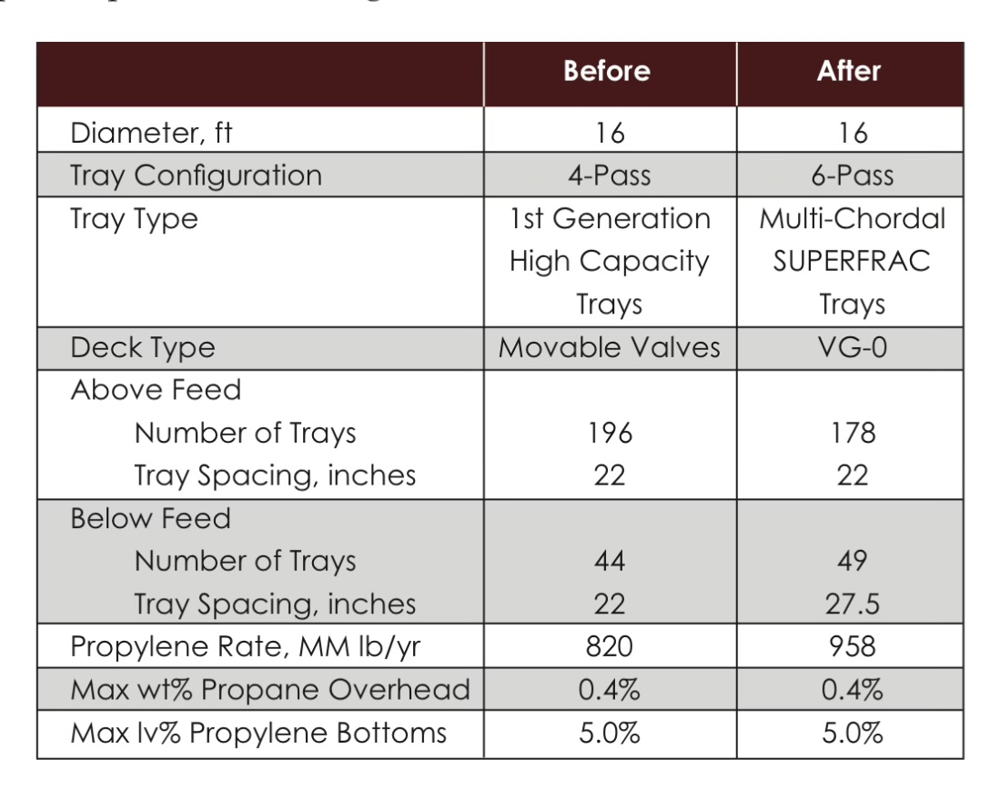
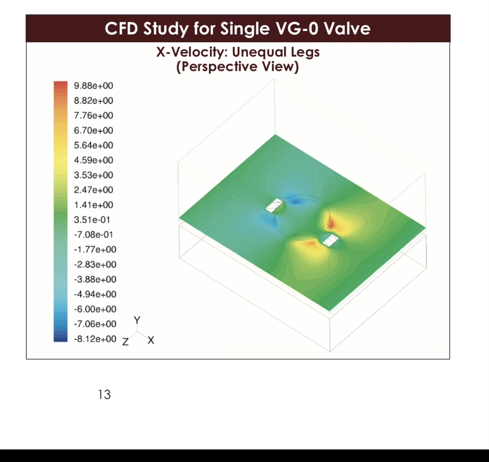

# HyTrays Apex -- Concept for a Severe-Service, Step-Change-Capacity Tray

This is a design-concept memo for a flagship HyTrays product positioned above
the existing line (Sieve / Ripple / Valve / Dualflow / High-Performance --
see `tray_library.py`). It is a paper exercise at this stage: no parameters
have been added to the comparison engine yet. Section 7 lays out exactly how
to do that once the concept is validated.

## 1. Target specification

| Requirement | Interpretation used here |
|---|---|
| Extreme fouling resistance | Large, simple, self-sweeping openings; no moving parts, no crevices |
| "Better than ULTRA-FRAC" | Outperform a Koch-Glitsch ULTRA-FRAC(R)-class multi-chordal high-capacity valve tray on capacity, fouling and pressure rating |
| 2x ULTRA-FRAC ultimate capacity | ~2x the vapor-handling capacity of a tray that is itself ~30-40% above conventional valve trays -- i.e. a step-change, not an incremental gain |
| 2-5 psi uplift resistance | A *structural/mechanical* deck rating (anti-flotation under upset/relief transients), separate from the hydraulic per-tray dP the Fair model computes |
| Higher vapor rates | Consequence of the capacity target above |

The retrofit data you shared (16 ft column, Movable-Valve -> Multi-Chordal
SUPERFRAC/VG-0, 196->178 trays above feed, 820->958 MM lb/yr propylene) is a
useful calibration point: a real deck-technology generation step bought
**~17% more throughput at the same diameter**. "2x ULTRA-FRAC" is therefore
not "one more generation of valve" -- it requires a different flooding
mechanism entirely, which is exactly what your co-current/cyclonic write-up
points at.


*Reference: real-world VG-0/multi-chordal retrofit at constant 16 ft
diameter -- ~17% capacity gain, used here as the "one generation" baseline
that "2x ULTRA-FRAC" must be measured against.*

## 2. The central conflict

| Goal | Wants... | ...which tends to give |
|---|---|---|
| Fouling resistance | Large, simple, fixed openings (Kister: big round holes/grids resist plugging best) | Lower per-pass efficiency, more weeping at low load |
| 2x capacity | Co-current jet zones + mechanical vapor/liquid separation (bypasses Souders-Brown flooding) | Small, precisely shaped elements -- typically the *opposite* of "simple and fouling-resistant" |
| 2-5 psi structural rating | Thick plate, dense support-beam grid, positively-clamped panels | Added weight/cost, less open area unless designed around it |

**HyTrays Apex resolves this by separating the "fouling-resistant flow
element" from the "capacity-boost element"**: the deck openings themselves
stay large, fixed and self-sweeping (fouling resistance); the capacity boost
comes from *how those openings are arranged and oriented* (directional
vortex zones), not from making them small and intricate like a mini-valve.
The structural rating comes from treating the deck as a load-bearing grid
from the start, which large simple openings make easier, not harder.

## 3. Architecture: "Directional Vortex-Grid"

### 3.1 Deck element -- large fixed directional slots, no moving parts

- Elongated, slightly louvered slots (think large fixed louvers, not
  valve caps) cut directly into a thick deck plate. No legs, hinges, or
  loose parts to seize, hang up, or trap deposits -- the single biggest
  fouling failure mode for valve trays (per `tray_library.py`'s
  `fouling_open_area_retention`: Valve = 0.70, the worst of the five).
- Slot width sized for *as-fouled* open area, not as-new -- i.e. designed
  assuming ~10% loss, so performance is specified at the fouled condition
  rather than degrading from a tighter as-new baseline.
- Rounded/chamfered slot edges (no sharp internal corners) to remove
  deposit-nucleation sites, the same logic that gives Dualflow its 0.92
  retention.

### 3.2 Co-current vortex boost zones

- Slots are grouped into banks, each bank canted at a common angle so
  vapor jets from adjacent slots converge and impart a *swirling,
  co-current* upward motion to the local vapor+liquid mixture -- the same
  principle as the VG-0 CFD slide you shared (the red/blue lobes show
  exactly this kind of paired-jet recirculation around each element,
  just at the single-valve scale; Apex generates it deliberately and at
  bank scale).

  
  *Reference: X-velocity CFD for a single VG-0 valve -- the red/blue lobes
  either side of the cap are exactly the paired-jet recirculation pattern
  Apex's vortex banks deliberately organize at bank scale, with a fixed
  vane cap for mechanical disengagement instead of relying on gravity
  settling.*
- Above each bank, a fixed vane/cyclone cap separates the entrained
  liquid from the vapor before it reaches the tray above -- no moving
  parts, just shaped sheet metal (low cost, fouling-resistant by the same
  logic as 3.1).
- Because the vortex banks handle vapor disengagement mechanically rather
  than relying on gravity settling across open tray area, the *classic
  Souders-Brown entrainment-flooding limit no longer applies to these
  zones* -- this is the mechanism that makes a step-change (not just
  incremental) capacity gain plausible.

### 3.3 Multi-chordal liquid handling

- Liquid distribution follows the multi-chordal pattern from your
  retrofit example (center + side downcomers), scaled to the column
  diameter. Vortex banks are arranged in chordal strips between
  downcomers so liquid sweep direction is set by the jet angle (per your
  "Orientation Advantage" point) -- this actively sweeps the deck and
  reduces stagnant zones, which is itself a fouling benefit.
- Downcomers are sloped/truncated (wide at top, narrow at bottom) to
  maximize active vortex-bank area without shrinking disengagement volume.

### 3.4 Structural deck for 2-5 psi uplift rating

- Deck plate thickness and beam spacing sized for a **5 psi transient /
  2 psi sustained** differential, treated as a structural design case
  (analogous to relief-event loading on tray decks), not just the normal
  operating dP.
- All deck panels positively bolted at perimeter *and* at intermediate
  beams (not just resting in support clips, the typical sieve/valve
  practice) -- this is cheap to add precisely *because* the large fixed
  slots (3.1) leave more solid plate area to bolt through than a
  valve-cap deck would.

```
        VAPOR + LIQUID  (co-current swirl, mechanical disengage)
            \\\   ///     \\\   ///
         ____\\\_///_______\\\_///____
        |   [vortex   ] [vortex   ]   |   <- fixed vane caps, no moving parts
   DC -->|  /=slots=\   /=slots=\     |<-- DC   (large, chamfered, fixed)
        |__beams_____beams______beams_|   <- dense bolted structural grid
              <----  liquid sweep  ---->
```

## 4. How each requirement is addressed

| Requirement | Feature | Expected outcome | Residual risk |
|---|---|---|---|
| Fouling | Large fixed chamfered slots, no moving parts, directional self-sweep | `fouling_open_area_retention` ~0.90-0.95 (best of the line, >= Dualflow's 0.92) | Vortex caps themselves could accumulate deposits over very long runs -- needs inspection-port access |
| 2x ULTRA-FRAC capacity | Vortex banks bypass Souders-Brown limit in "boost" regime | Step-change above ~2.2-2.8x plain-sieve C_SBF in boost regime (Sec. 5) | Only active above a minimum vapor velocity -- see turndown risk below |
| 2-5 psi uplift rating | Thick bolted deck, dense beam grid, large-slot plate has more bolt-through area | Meets spec as a *mechanical* design case, independent of hydraulic dP | Added deck weight/cost vs conventional trays |
| Higher vapor rates | Direct consequence of capacity target | Smaller diameter for given duty, or same diameter at much higher throughput | -- |
| Efficiency | Directional sweep removes stagnant zones; vortex disengagement limits entrainment | Likely close to conventional sieve/valve E_OC (not a step-change either way) | Co-current contacting has inherently lower driving force per pass than counter-current crossflow -- needs CFD/pilot data to confirm net effect |
| Turndown | Below the vortex "switch-on" velocity, deck behaves like a plain large-open-area grid | Likely the *weakest* metric of the five trays -- see Sec. 5 | May need a secondary, smaller-slot "low-load" zone to avoid deep weeping |

## 5. Quantitative positioning (for `tray_library.py` once validated)

Two physical *regimes*, because a single capacity_factor multiplier on
Fair's C_SBF cannot represent a mechanism that bypasses Fair's correlation
altogether:

- **Regime A -- crossflow/turndown mode** (vapor velocity below the vortex
  "switch-on" threshold `u_transition`): deck behaves like a large-open-area
  fixed grid. Conventional Fair correlation applies directly.
- **Regime B -- co-current boost mode** (above `u_transition`): vortex banks
  active, classic flooding limit does not apply; capacity governed by a
  jet/cyclone carrying-capacity correlation instead of C_SBF.

| Parameter | Sieve (ref) | ULTRA-FRAC-class (est.) | HyTrays Apex -- Regime A | HyTrays Apex -- Regime B (stretch) |
|---|---|---|---|---|
| `capacity_factor` (x sieve C_SBF) | 1.00 | ~1.35 | ~1.1-1.2 | **~2.4-2.8 (≈1.8-2.1x ULTRA-FRAC)** |
| `f_active` | 0.78 | ~0.85 | ~0.90 | (same deck, Regime B) |
| `f_hole` | 0.10 | ~0.14 | ~0.18-0.22 (large slots) | (same) |
| `efficiency_factor` | 1.00 | ~0.97 | ~0.95-1.00 | ~0.90-0.97 (co-current penalty, TBD) |
| `min_load_frac` | 0.50 | ~0.40 | ~0.55-0.65 (worst of line) | n/a -- reverts to Regime A |
| `fouling_open_area_retention` | 0.75 | ~0.80 | **~0.90-0.95 (best of line)** | (same) |
| New: `deck_pressure_rating_psi` | n/a | n/a | (2.0, 5.0) -- mechanical, not hydraulic | (same) |

The Regime-B capacity_factor range is the headline "2x ULTRA-FRAC" claim
(2.4-2.8x sieve / ULTRA-FRAC ~1.35x sieve => ~1.8-2.1x ULTRA-FRAC). It is
deliberately shown as a *range with a "(stretch)" label* -- this is the
number that needs CFD/pilot validation before it goes into a real datasheet.

## 6. Open questions / R&D needs

1. **`u_transition`** -- the vapor velocity at which vortex banks engage.
   Too high and turndown collapses (Regime A only, capacity_factor ~1.1-1.2,
   barely better than plain sieve); too low and the "boost" isn't usable
   across enough of the operating range to matter.
2. **Co-current efficiency penalty** -- needs CFD (the VG-0 unequal-legs
   plot you shared is exactly the right *kind* of study, scaled up to a
   vortex bank) and/or a cold-flow pilot to quantify `efficiency_factor` in
   Regime B.
3. **Turndown mitigation** -- is a secondary low-load flow path (smaller
   bleed slots that stay active at low vapor rate) worth the added
   complexity/fouling risk, or is ~0.55-0.65 `min_load_frac` acceptable for
   the target severe-service applications (which often run closer to design
   rate anyway)?
4. **Manufacturability/cost** -- thicker bolted deck + vane caps vs.
   conventional stamped valve decks; first-order cost multiple needed before
   this is more than a concept.

## 7. Path into the HyTrays comparison framework (not yet done)

Once `u_transition` and the Regime-B capacity range have at least a
placeholder basis (CFD or literature analog):

1. Add a `csbf_cocurrent()` function to `column_hydraulics.py` and a
   regime switch in `design_tray()` keyed on `u_design` vs. `u_transition`.
2. Add `HYTRAYS_APEX` to `tray_library.py` with the Regime-A parameters from
   Sec. 5 as the conservative default (so it slots into the existing
   single-regime engine immediately), and the Regime-B numbers gated behind
   the new function once (1) is done.
3. Add a "Severe Fouling + High-dP" service case to `service_cases.py`
   (high mu_L *and* fouling=True *and* a vapor rate high enough to test
   `u_transition`), and re-run `run_service_comparison.py` to add Apex to
   the existing 5-tray study.

## 8. One-line summary

HyTrays Apex = Dualflow-grade fouling resistance and a bolted, over-built
deck (for the 2-5 psi structural ask), with directional vortex banks added
*on top of* the large fixed slots to deliver a step-change capacity boost
above the Souders-Brown limit -- at the cost of turndown, which becomes the
tray's primary design trade-off and R&D focus.
