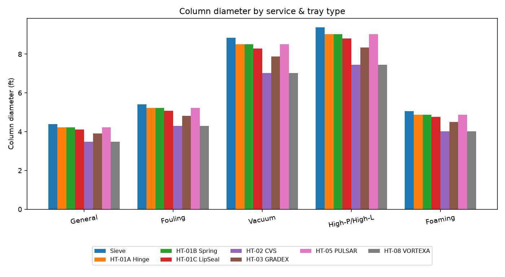
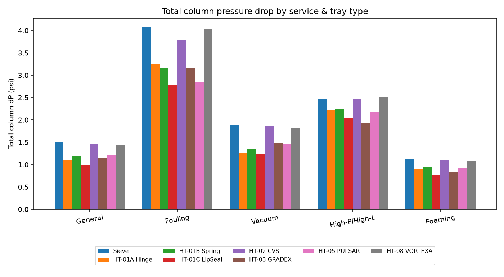
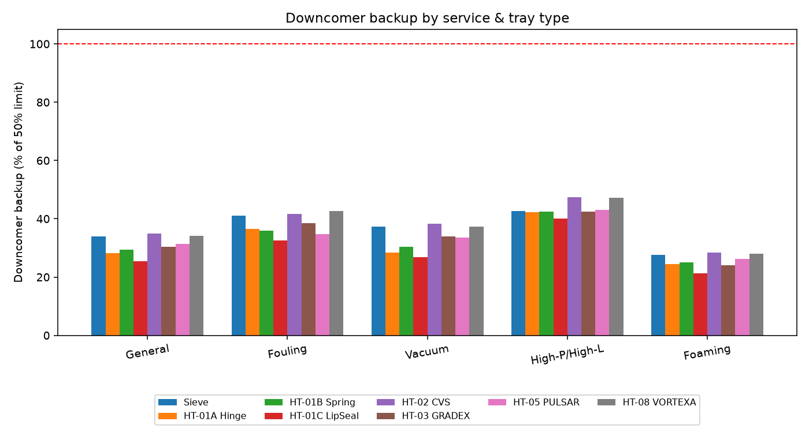
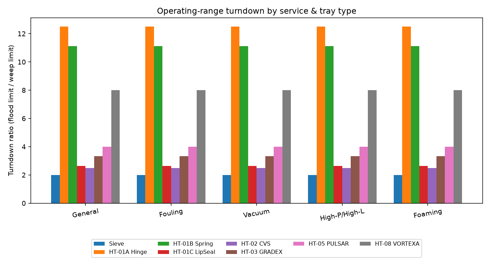
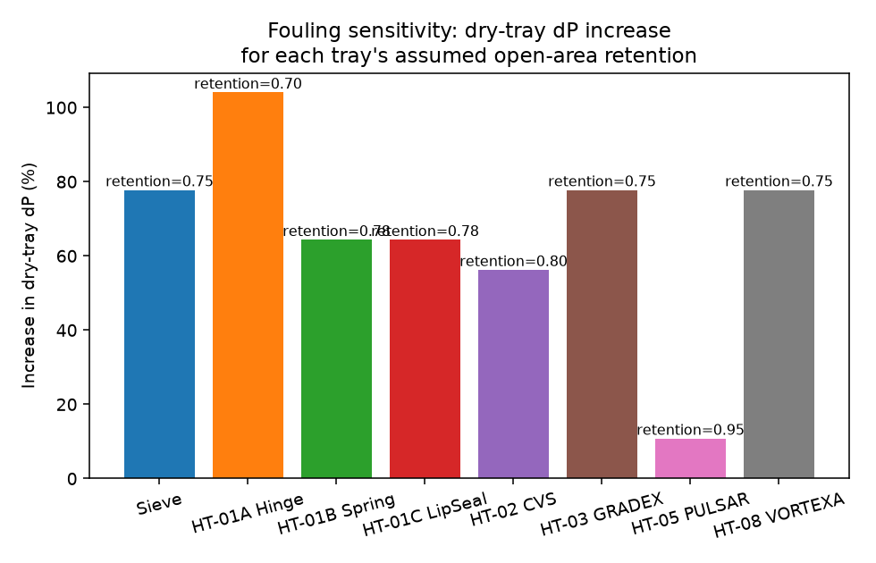

# HyTrays Tray Selection Study -- Numerical Comparison Across Services

The conventional **Sieve** baseline and the six HyTrays HT-series contacting decks -- **HT-01A Hinge, HT-01B Spring, HT-01C LipSeal, HT-02 CVS, HT-03 GRADEX and HT-05 PULSAR** -- are sized and rated with the Fair-correlation tray-hydraulics engine in `column_hydraulics.py` across five representative distillation services. The goal is to make the trade-offs that drive tray selection (capacity, pressure drop, downcomer backup, turndown and fouling resistance) explicit and reproducible.

> The DCX (HT-04 downcomer module), VortiValve (HT-06 inlet device) and AEGIS (HT-07 structural overlay) HT-series members are not standalone contacting decks and so are not sized by this 1-D engine -- see `tray_library.NON_DECK_MODULES`.

## 1. Tray types compared

| Tray | f_active | f_hole | h_weir (in) | C0 | Aeration factor | Capacity factor | Efficiency factor | Min load frac | Fouling open-area retention |
|---|---|---|---|---|---|---|---|---|---|
| Sieve | 0.78 | 0.10 | 2.0 | 0.73 | 0.55 | 1.00 | 1.00 | 0.50 | 0.75 |
| HT-01A Hinge | 0.80 | 0.14 | 2.0 | 0.73 | 0.55 | 1.05 | 1.05 | 0.08 | 0.70 |
| HT-01B Spring | 0.80 | 0.13 | 2.0 | 0.73 | 0.55 | 1.05 | 1.05 | 0.09 | 0.78 |
| HT-01C LipSeal | 0.82 | 0.13 | 1.5 | 0.78 | 0.52 | 1.08 | 1.02 | 0.38 | 0.78 |
| HT-02 CVS | 0.75 | 0.15 | 2.0 | 0.80 | 0.50 | 1.65 | 1.00 | 0.40 | 0.80 |
| HT-03 GRADEX | 0.82 | 0.11 | 1.5 | 0.82 | 0.50 | 1.20 | 1.12 | 0.30 | 0.75 |
| HT-05 PULSAR | 0.80 | 0.12 | 2.0 | 0.71 | 0.55 | 1.05 | 1.10 | 0.25 | 0.95 |
| HT-08 VORTEXA | 0.75 | 0.15 | 2.0 | 0.82 | 0.50 | 1.65 | 0.98 | 0.12 | 0.75 |

> *HT-series parameters are derived from the datasheets in `HyTrays/Datasheets/` and are engineering estimates for relative screening -- refine against detailed vendor/test data before absolute design.*

## 2. Services evaluated

| Service | V (lb/hr) | L (lb/hr) | rho_V (lb/ft3) | rho_L (lb/ft3) | sigma (dyn/cm) | mu_L (cP) | alpha | Tray spacing (in) | f_flood | System factor | Fouling? | N_theoretical |
|---|---|---|---|---|---|---|---|---|---|---|---|---|
| General Rectification (T801 basis) | 52,449 | 14,798 | 1.018 | 30.0 | 9.0 | 0.12 | 1.40 | 24 | 80% | 1.00 | False | 20 |
| Fouling / Heavy-Ends Service | 45,000 | 90,000 | 0.400 | 42.0 | 18.0 | 3.00 | 1.15 | 24 | 65% | 1.00 | True | 15 |
| Vacuum Tower Section | 80,000 | 40,000 | 0.060 | 38.0 | 14.0 | 1.20 | 1.20 | 30 | 80% | 1.00 | False | 8 |
| High-Pressure / High-Liquid-Load Service (C3/C4 splitter) | 150,000 | 300,000 | 2.000 | 28.0 | 5.0 | 0.08 | 1.15 | 24 | 80% | 1.00 | False | 40 |
| Foaming Service | 52,449 | 14,798 | 1.018 | 30.0 | 9.0 | 0.12 | 1.40 | 24 | 80% | 0.75 | False | 20 |

- **General Rectification (T801 basis)**: Mid-pressure hydrocarbon rectifying section -- vapor/liquid loads and vapor density from T801-OH / T801-REFLUX (Hydraulics/HMB.xlsx); liquid density, viscosity, surface tension and alpha are estimates for ~344 F / 105 psia.
- **Fouling / Heavy-Ends Service**: Heavy, viscous, deposit-forming liquid (e.g. coker main fractionator wash/slurry section): high liquid load, high viscosity, close relative volatility. Sized at a reduced 65% of flood to leave margin for deposit buildup; evaluated with tray.fouling_open_area_retention applied (fouling=True).
- **Vacuum Tower Section**: Low-pressure HVGO-type section: very low vapor density drives large diameters and high superficial velocities; every inch of tray dP raises the flash-zone temperature, so dP/tray is the key discriminator. 30 in. tray spacing (common practice in vacuum towers).
- **High-Pressure / High-Liquid-Load Service (C3/C4 splitter)**: High-pressure light-ends splitter: high reflux ratio (L/V ~ 2), low surface tension, low relative volatility drives many stages. High FLV stresses downcomer/liquid handling rather than vapor capacity.
- **Foaming Service**: Same traffic/properties as General Rectification but with a moderate foaming system factor (Fp = 0.75, Kister Table 1-2) applied uniformly to every tray's flooding velocity -- representative of amine/glycol-type foaming tendencies.

## 3. Cross-service comparison

## 4. Results & discussion by service

### 4.1 General Rectification (T801 basis)

| Tray | Diameter (ft) | u_nf (ft/s) | dP/tray (psi) | DC backup (% lim) | Operating window (% design) | Turndown | Eff (%) | N_actual | Height (ft) | Total dP (psi) |
|---|---|---|---|---|---|---|---|---|---|---|
| Sieve | 4.39 | 1.52 | 0.0557 | 34 | 62-125 | 2.00:1 | 76.2 | 27 | 64.0 | 1.503 |
| HT-01A Hinge | 4.23 | 1.59 | 0.0426 | 28 | 10-125 | 12.50:1 | 80.0 | 26 | 62.0 | 1.107 |
| HT-01B Spring | 4.23 | 1.59 | 0.0453 | 29 | 11-125 | 11.11:1 | 80.0 | 26 | 62.0 | 1.178 |
| HT-01C LipSeal | 4.12 | 1.64 | 0.0380 | 25 | 48-125 | 2.63:1 | 77.7 | 26 | 62.0 | 0.989 |
| HT-02 CVS | 3.48 | 2.50 | 0.0545 | 35 | 50-125 | 2.50:1 | 76.2 | 27 | 64.0 | 1.473 |
| HT-03 GRADEX | 3.91 | 1.82 | 0.0478 | 30 | 38-125 | 3.33:1 | 85.3 | 24 | 58.0 | 1.146 |
| HT-05 PULSAR | 4.23 | 1.59 | 0.0500 | 31 | 31-125 | 4.00:1 | 83.8 | 24 | 58.0 | 1.201 |
| HT-08 VORTEXA | 3.48 | 2.50 | 0.0531 | 34 | 16-125 | 8.00:1 | 74.7 | 27 | 64.0 | 1.433 |

FLV = 0.052 (vapor-dominated). The smallest shell is **HT-02 CVS** (3.48 ft vs 4.39 ft for the Sieve baseline), and the highest efficiency is **HT-03 GRADEX** (85.3%), giving the shortest column (HT-03 GRADEX: 58 ft, 24 trays). The lowest total column dP is **HT-01C LipSeal** (0.99 psi vs 1.50 psi for Sieve). Across the HT-series decks the efficiency uplift (HT-03 GRADEX / HT-05 PULSAR) and capacity (HT-02 CVS) are the main levers in this clean, vapor-dominated service.

### 4.2 Fouling / Heavy-Ends Service

| Tray | Diameter (ft) | u_nf (ft/s) | dP/tray (psi) | DC backup (% lim) | Operating window (% design) | Turndown | Eff (%) | N_actual | Height (ft) | Total dP (psi) |
|---|---|---|---|---|---|---|---|---|---|---|
| Sieve | 5.42 | 2.67 | 0.0905 | 41 | 77-154 | 2.00:1 | 33.5 | 45 | 100.0 | 4.070 |
| HT-01A Hinge | 5.22 | 2.81 | 0.0756 | 37 | 12-154 | 12.50:1 | 35.2 | 43 | 96.0 | 3.250 |
| HT-01B Spring | 5.22 | 2.81 | 0.0737 | 36 | 14-154 | 11.11:1 | 35.2 | 43 | 96.0 | 3.171 |
| HT-01C LipSeal | 5.08 | 2.89 | 0.0632 | 33 | 58-154 | 2.63:1 | 34.2 | 44 | 98.0 | 2.783 |
| HT-02 CVS | 4.30 | 4.41 | 0.0843 | 42 | 62-154 | 2.50:1 | 33.5 | 45 | 100.0 | 3.792 |
| HT-03 GRADEX | 4.82 | 3.21 | 0.0791 | 38 | 46-154 | 3.33:1 | 37.5 | 40 | 90.0 | 3.165 |
| HT-05 PULSAR | 5.22 | 2.81 | 0.0694 | 35 | 38-154 | 4.00:1 | 36.9 | 41 | 92.0 | 2.847 |
| HT-08 VORTEXA | 4.30 | 4.41 | 0.0875 | 43 | 19-154 | 8.00:1 | 32.9 | 46 | 102.0 | 4.023 |

Sized at 65% of flood (margin for deposit buildup) with each tray's hole area derated by `fouling_open_area_retention`. The standalone fouling-sensitivity result (Fig. 15, independent of flow rates) shows the underlying mechanism -- for a tray whose open area survives at fraction *r* of as-new, dry-tray dP rises by (1/r)^2 - 1:

| Tray | Open-area retention | Dry-tray dP increase |
|---|---|---|
| Sieve | 0.75 | +78% |
| HT-01A Hinge | 0.70 | +104% |
| HT-01B Spring | 0.78 | +64% |
| HT-01C LipSeal | 0.78 | +64% |
| HT-02 CVS | 0.80 | +56% |
| HT-03 GRADEX | 0.75 | +78% |
| HT-05 PULSAR | 0.95 | +11% |
| HT-08 VORTEXA | 0.75 | +78% |

The most fouling-tolerant tray here is **HT-05 PULSAR** (retention 0.95, only +11% dry-tray dP as deposits build), keeping it usable far longer between cleanings -- by design for HT-05 PULSAR, whose self-sweeping jet and lack of moving parts resist plugging. The least tolerant is **HT-01A Hinge** (+104%; crevices/moving parts), while the plain Sieve baseline rises by roughly 78%. The adaptive HT-01 hinge/lip decks sit lower than PULSAR because their moving flaps and lips offer more crevices for deposits.

### 4.3 Vacuum Tower Section

| Tray | Diameter (ft) | u_nf (ft/s) | dP/tray (psi) | DC backup (% lim) | Operating window (% design) | Turndown | Eff (%) | N_actual | Height (ft) | Total dP (psi) |
|---|---|---|---|---|---|---|---|---|---|---|
| Sieve | 8.84 | 9.67 | 0.1050 | 37 | 62-125 | 2.00:1 | 45.9 | 18 | 55.0 | 1.891 |
| HT-01A Hinge | 8.52 | 10.16 | 0.0735 | 28 | 10-125 | 12.50:1 | 48.1 | 17 | 52.5 | 1.249 |
| HT-01B Spring | 8.52 | 10.16 | 0.0800 | 30 | 11-125 | 11.11:1 | 48.1 | 17 | 52.5 | 1.360 |
| HT-01C LipSeal | 8.29 | 10.45 | 0.0692 | 27 | 48-125 | 2.63:1 | 46.8 | 18 | 55.0 | 1.245 |
| HT-02 CVS | 7.02 | 15.96 | 0.1039 | 38 | 50-125 | 2.50:1 | 45.9 | 18 | 55.0 | 1.870 |
| HT-03 GRADEX | 7.87 | 11.61 | 0.0931 | 34 | 38-125 | 3.33:1 | 51.4 | 16 | 50.0 | 1.489 |
| HT-05 PULSAR | 8.52 | 10.16 | 0.0914 | 34 | 31-125 | 4.00:1 | 50.4 | 16 | 50.0 | 1.463 |
| HT-08 VORTEXA | 7.02 | 15.96 | 0.1004 | 37 | 16-125 | 8.00:1 | 44.9 | 18 | 55.0 | 1.807 |

With rho_V = 0.06 lb/ft3, superficial velocities and diameters are large for all trays (7.0-8.8 ft). Per-tray dP is what matters most here, because every inch of tray dP raises the flash-zone temperature. The lowest per-tray dP is **HT-01C LipSeal** (69.2 mpsi, C0 = 0.78) and the highest is **Sieve** (105 mpsi, C0 = 0.73). The HT-series decks with higher discharge coefficients (HT-02 CVS swirl tubes, HT-03 GRADEX push valves) hold the per-tray dP down, while low-C0 sieve-like decks run highest -- multiplied over a real vacuum tower's tray count, that gap is what drives vacuum-service designs toward higher-C0 or high-capacity internals.

### 4.4 High-Pressure / High-Liquid-Load Service (C3/C4 splitter)

| Tray | Diameter (ft) | u_nf (ft/s) | dP/tray (psi) | DC backup (% lim) | Operating window (% design) | Turndown | Eff (%) | N_actual | Height (ft) | Total dP (psi) |
|---|---|---|---|---|---|---|---|---|---|---|
| Sieve | 9.38 | 0.48 | 0.0513 | 43 | 62-125 | 2.00:1 | 84.7 | 48 | 106.0 | 2.463 |
| HT-01A Hinge | 9.04 | 0.51 | 0.0494 | 42 | 10-125 | 12.50:1 | 88.9 | 45 | 100.0 | 2.221 |
| HT-01B Spring | 9.04 | 0.51 | 0.0499 | 43 | 11-125 | 11.11:1 | 88.9 | 45 | 100.0 | 2.246 |
| HT-01C LipSeal | 8.80 | 0.52 | 0.0434 | 40 | 48-125 | 2.63:1 | 86.4 | 47 | 104.0 | 2.038 |
| HT-02 CVS | 7.45 | 0.80 | 0.0514 | 47 | 50-125 | 2.50:1 | 84.7 | 48 | 106.0 | 2.467 |
| HT-03 GRADEX | 8.35 | 0.58 | 0.0448 | 42 | 38-125 | 3.33:1 | 94.8 | 43 | 96.0 | 1.927 |
| HT-05 PULSAR | 9.04 | 0.51 | 0.0509 | 43 | 31-125 | 4.00:1 | 93.1 | 43 | 96.0 | 2.187 |
| HT-08 VORTEXA | 7.45 | 0.80 | 0.0511 | 47 | 16-125 | 8.00:1 | 83.0 | 49 | 108.0 | 2.504 |

FLV = 0.535 (high, liquid-dominated). Downcomer backup margins shrink markedly versus the General case (43% vs 34% for the Sieve baseline) because the smaller diameters needed for high-capacity trays shorten the weir, increasing the Francis-weir crest (h_ow) for the same liquid rate. The tightest downcomer margin here is **HT-02 CVS** (47% of the 50% limit) -- the high-capacity HT-series decks (e.g. HT-02 CVS) buy the smallest shell but pay for it in downcomer loading at high FLV. A real design at this FLV would likely need wider downcomers or a larger diameter than the flood-only sizing shown; the HT-04 DCX active downcomer module (see `NON_DECK_MODULES`) is aimed squarely at this high-weir-loading regime.

### 4.5 Foaming Service

| Tray | Diameter (ft) | u_nf (ft/s) | dP/tray (psi) | DC backup (% lim) | Operating window (% design) | Turndown | Eff (%) | N_actual | Height (ft) | Total dP (psi) |
|---|---|---|---|---|---|---|---|---|---|---|
| Sieve | 5.07 | 1.14 | 0.0418 | 28 | 62-125 | 2.00:1 | 76.2 | 27 | 64.0 | 1.130 |
| HT-01A Hinge | 4.88 | 1.19 | 0.0345 | 24 | 10-125 | 12.50:1 | 80.0 | 26 | 62.0 | 0.898 |
| HT-01B Spring | 4.88 | 1.19 | 0.0361 | 25 | 11-125 | 11.11:1 | 80.0 | 26 | 62.0 | 0.937 |
| HT-01C LipSeal | 4.75 | 1.23 | 0.0295 | 21 | 48-125 | 2.63:1 | 77.7 | 26 | 62.0 | 0.766 |
| HT-02 CVS | 4.02 | 1.88 | 0.0406 | 28 | 50-125 | 2.50:1 | 76.2 | 27 | 64.0 | 1.095 |
| HT-03 GRADEX | 4.51 | 1.37 | 0.0347 | 24 | 38-125 | 3.33:1 | 85.3 | 24 | 58.0 | 0.833 |
| HT-05 PULSAR | 4.88 | 1.19 | 0.0387 | 26 | 31-125 | 4.00:1 | 83.8 | 24 | 58.0 | 0.930 |
| HT-08 VORTEXA | 4.02 | 1.88 | 0.0397 | 28 | 16-125 | 8.00:1 | 74.7 | 27 | 64.0 | 1.073 |

Applying Kister's moderate-foam system factor (Fp = 0.75) derates every tray's flooding velocity equally, so diameters grow by 1/sqrt(Fp) = 1.15x relative to the General case (e.g. Sieve 4.39 -> 5.07 ft) for every tray type -- the relative ranking by capacity is unchanged. The differentiator in foaming service is froth intensity: trays with a lower aeration factor generate less aerated froth for the same clear-liquid height and are generally more foam-tolerant. The lowest here is **HT-02 CVS** (aeration 0.50) and the highest is **Sieve** (0.55); the capacity-oriented HT-series decks (HT-02 CVS, HT-03 GRADEX) run leaner froth than the adaptive sieve-like HT-01 decks.

## 5. Tray selection guidance matrix

Rank 1 = best, 5 = worst, by the metric noted for each service (footnotes below).

| Tray | General [1] | Fouling [2] | Vacuum [3] | High-P/High-L [4] | Foaming [5] |
|---|---|---|---|---|---|
| Sieve | 8 (1.5) | 5 (0.75) | 8 (0.105) | 5 (42.7) | 5 (0.55) |
| HT-01A Hinge | 2 (1.11) | 8 (0.7) | 2 (0.0735) | 2 (42.3) | 6 (0.55) |
| HT-01B Spring | 4 (1.18) | 3 (0.78) | 3 (0.08) | 4 (42.5) | 7 (0.55) |
| HT-01C LipSeal | 1 (0.989) | 4 (0.78) | 1 (0.0692) | 1 (40.1) | 4 (0.52) |
| HT-02 CVS | 7 (1.47) | 2 (0.8) | 7 (0.104) | 8 (47.3) | 1 (0.5) |
| HT-03 GRADEX | 3 (1.15) | 6 (0.75) | 5 (0.0931) | 3 (42.4) | 2 (0.5) |
| HT-05 PULSAR | 5 (1.2) | 1 (0.95) | 4 (0.0914) | 6 (43) | 8 (0.55) |
| HT-08 VORTEXA | 6 (1.43) | 7 (0.75) | 6 (0.1) | 7 (47.2) | 3 (0.5) |

[1] **General** (General Rectification (T801 basis)): Lower total column dP across the N_actual trays needed for the target separation (psi).
[2] **Fouling** (Fouling / Heavy-Ends Service): Higher fouling open-area retention -> smaller dry-tray dP increase as deposits build up (see fouling sensitivity figure).
[3] **Vacuum** (Vacuum Tower Section): Lower per-tray dP -- directly limits flash-zone temperature rise in vacuum service.
[4] **High-P/High-L** (High-Pressure / High-Liquid-Load Service (C3/C4 splitter)): Lower downcomer backup (% of the 50%-of-spacing limit) at high FLV. All HT-series decks here are weired; the HT-04 DCX active-downcomer module (not rated by this engine) is the family's dedicated answer to high weir loading.
[5] **Foaming** (Foaming Service): Lower aeration factor -> less intense froth generation -> generally more foam-tolerant.

## 6. Conclusions & limitations

- **HT-02 CVS** (centrifugal swirl) wins on raw capacity -- the smallest shell across services and capacity decoupled from tray spacing -- making it the pick where shell diameter / plot space is the controlling constraint, at the cost of narrower turndown and tighter downcomer margins at high FLV.
- **HT-03 GRADEX** (radially-graded push valves) is the efficiency lever, especially on large-diameter trays (Peclet/plug-flow gain), shortening the column where many stages are needed.
- **HT-05 PULSAR** (fluidic oscillator) is the fouling specialist: the best open-area retention in the family with no moving parts, plus a useful efficiency bump -- the choice for deposit-forming service.
- **HT-01A Hinge / HT-01B Spring** (adaptive flap decks) deliver the widest turndown in the family for columns that must run efficiently over a very wide load range; the spring variant trades a little turndown for robustness and better fouling resistance.
- **HT-01C LipSeal** (check-valve lips) is the straightforward weep-resistant upgrade from plain sieve where mild turndown is the issue.
- **Sieve** remains the simplest/cheapest baseline, included here only as the reference the HT-series factors are measured against.
- The **DCX (HT-04)**, **VortiValve (HT-06)** and **AEGIS (HT-07)** family members are not standalone decks and are not rated here; DCX in particular targets the high-weir-loading regime exposed by the High-P/High-L service above.

**Model limitations** -- read before using these numbers for anything beyond relative tray-type screening:
- Fair's C_SBF curve fit is valid for FLV = 0.01-1.0 and tray spacing 6-24 in (the Vacuum case uses 30 in, slightly outside the fitted range, and the High-P/High-L case has FLV at the top of the range).
- Turndown/weep is represented by each tray's datasheet-derived `min_load_frac`, not a first-principles weep-point correlation; entrainment is not explicitly modeled.
- The HT-series decks are modeled as single bubbling decks on a standard weir/downcomer layout; device-specific physics (centrifugal swirl, fluidic oscillation, adaptive-flap dynamics) are folded into the capacity / efficiency / turndown / open-area factors rather than resolved mechanistically.
- All HT-series parameters are engineering estimates derived from the datasheets in `HyTrays/Datasheets/` for *relative* screening -- refine against detailed vendor/test data before absolute design.

---
*Generated by `HyTrays/run_service_comparison.py`. Edit `service_cases.py` (operating conditions per service) or `tray_library.py` (tray parameters) and re-run to update every table, figure and number in this report.*
